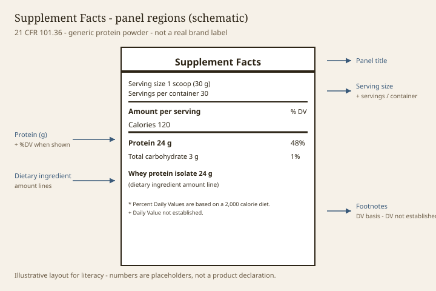

# Supplement Facts vs Nutrition Facts

> **Pack:** Protein powder label literacy — staged draft.  
> **Jurisdiction:** United States (FD&C Act as amended by DSHEA, 1994).  
> **Class:** Consumer education. Not a product label. Not medical advice. Not an advertisement.  
> **Lock:** This draft does not claim that any protein powder diagnoses, treats, cures, or prevents any disease.  
> **Statute (teaching):** Under DSHEA, a dietary supplement label may not claim to diagnose, treat, cure, or prevent any disease.

## The move

The box on the back is not a design choice. **Nutrition Facts** (21 CFR 101.9) is the food box. **Supplement Facts** (21 CFR 101.36) is the dietary-supplement box. They share a family resemblance — serving size, calories, protein grams — and then they diverge in ways that change what a protein-powder shopper can infer. If you read one box with the other box’s rules, you will invent duties the firm did not have and miss duties it did.

## What both boxes owe you

Both will usually show:

- a serving size,
- servings per container (when the package is not a single serving),
- calories when they are present above the rounding zero,
- protein in grams when protein is present above the rounding zero (with a special exception on some amino-acid-only supplements — PSL-25),
- other (b)(2) nutrients when they cannot be declared as zero.

Both are **rounded**. A gram on a panel is a legal gram, not a laboratory printout to three decimals. Literacy respects rounding and still does the arithmetic in PSL-41.

## How Supplement Facts is a different grid

> **Photo:** Generic Supplement Facts box with region callouts.  
> **Caption:** Panel anatomy for a protein powder — schematic, not a real brand.  
> **License note:** Original, `assets/supplement-facts-anatomy/facts-panel-anatomy.svg`.

<figure class="blog-figure">
  
  <figcaption><strong>Figure.</strong> Regions of a typical Supplement Facts panel for a protein powder (21 CFR 101.36). <em>Original schematic; not a product label, clinical data, or a product claim.</em></figcaption>
</figure>

**Dietary ingredients that are not in the Nutrition Facts core set can appear as their own lines.**  
A supplement can list whey protein, a proprietary blend, and an enzyme mix as **dietary ingredients** with amounts, not only hide them in an ingredient list. A food’s Nutrition Facts will not give you a line that says “whey protein isolate 28 g” unless the brand is also making a voluntary statement elsewhere. On a supplement, that line *is* the statement.

**(b)(2) nutrients that are zero are supposed to vanish.**  
21 CFR 101.36 tells the firm not to declare (b)(2) nutrients that are absent or that round to zero. A Supplement Facts panel that looks “short” may be legal. A Nutrition Facts panel has a more familiar mandatory skeleton. Do not call a short supplement box “hiding fat” until you have checked whether fat rounds to zero.

**Protein %DV, when it appears, uses the same adult 50 g Daily Reference Value idea as food** — and the same PDCAAS-correction rule when %DV is required (PSL-13). The trigger for *having* to show protein %DV is easy to miss: a protein **claim** outside the box can force the corrected %DV inside the box.

**Ingredients vs dietary ingredients.**  
Supplements still have an ingredient list (or an equivalent declaration). They also have the facts box. Reading only one of those is how people miss soy lecithin, sucralose, or a milk allergen that is obvious in the other place.

## How Nutrition Facts is a different grid

A protein **food** (a baking blend, a drink mix represented as food) will look like every other packaged food: added sugars line, a more predictable vitamin/mineral set after the 2016 label update, and no DSHEA disclaimer hanging off a structure/function sentence. If that food still talks like a supplement — “daily serving of this dietary ingredient” — you are back in PSL-05’s category tension.

## A protein powder can wear either box

This is the practical shock. Walk a store aisle:

- Brand A: “Dietary supplement” + Supplement Facts + disclaimer.
- Brand B: “Protein drink mix” + Nutrition Facts + recipe directions + no disclaimer.

Same scoop-shaped object. Different legal clothes. Neither clothes-set answers “should I eat this?” Both clothes-sets answer “what rules was this label written under?”

## What the title of the box is telling you about claims

Supplement Facts is a hint that the brand may want access to the **§ 403(r)(6) statement path** (structure/function + disclaimer + notification). Nutrition Facts is a hint that the brand is occupying **food** speech. Hints are not verdicts. Read the claims anyway (stage 6). But if you only have ten seconds, the title of the box is the fastest category signal on the canister after the words “dietary supplement.”

## Label drill

Photograph one Supplement Facts and one Nutrition Facts protein product. Draw a Venn diagram with three buckets:

- Lines that appear on both (list them).  
- Lines or features only on the supplement (proprietary blend? dietary-ingredient amounts? disclaimer nearby?).  
- Lines or features only on the food (added sugars formatting, a longer mandatory nutrient set, recipe nutrition).

Write one sentence: “The product I would have called ‘just protein powder’ is actually labeled as _____.” If you cannot fill the blank, you are not done with PSL-05.

## What this draft will not say

It will not say Supplement Facts is stricter or looser than Nutrition Facts as a moral matter. It will not say a food-labeled powder is “real food” and a supplement-labeled powder is “chemical.” It will not translate either box into a health outcome.

## Carry forward

PSL-12 is the serving-size problem: scoops, grams, household measures, and the front of the tub that quietly changed the serving.
