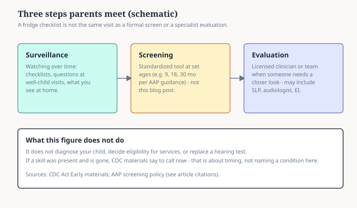

# Embed — how-to-read-a-milestone-chart

```html
<figure class="slpwow-figure slpwow-figure--diagram" itemscope itemtype="https://schema.org/ImageObject">
  
  <figcaption itemprop="caption">
    <strong>Figure 1.</strong> Surveillance, screening, and evaluation are different steps (schematic). A parent-facing checklist supports ongoing surveillance; formal screens and specialist evaluations follow their own rules and tools.
    <span class="figure-credit">SLPWOW pediatric milestones — original editorial SVG. Not medical advice.</span>
  </figcaption>
</figure>
```
