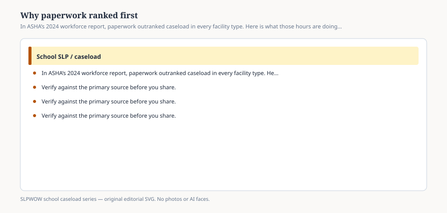

**Disclaimer.** Educational only. Not legal, billing, union, or clinical advice. Not a diagnosis and not a treatment protocol. This series does not use student records or any protected health information (PHI). Local IDEA, FERPA, Medicaid, and district rules govern practice. Talk with your district, a licensed speech-language pathologist, or counsel before changing services.

If you only remember one ranking from the 2024 workforce report, remember this one: **large amount of paperwork** was the highest of 13 challenges in every type of facility ASHA asked about. Day/residential. Preschool. Elementary. Secondary. Student homes. Telepractice offices. Combination. The asterisks in Table 1 are doing facility-by-facility significance tests. They are not needed for the first row. Paperwork is first everywhere.

High workload / caseload size is second in most facility types. Meetings are third overall. The feed usually prints the second row and calls it the story. The people who answered printed the first.

## Six hours that are not “notes”

<figure class="slpwow-figure slpwow-figure--infographic" itemscope itemtype="https://schema.org/ImageObject">
  
  <figcaption itemprop="caption">
    <strong>Figure 1.</strong> In ASHA’s 2024 workforce report, paperwork outranked caseload in every facility type. Here is what those hours are doing.
    SLPWOW school caseload series — original SVG. Not legal, billing, union, or clinical advice.
  </figcaption>
</figure>

The caseload report’s activity list (n = 2,347 full-time clinical providers with at least one student, hours capped at 55) put documentation at a **mean of 6.0 hours** in a typical week. Direct intervention took 22.6. Diagnostics 4.0. Consultation 2.5. Supervision 1.1. Tech checks 0.7. Other duties 2.4. Mean total 39.3.

Six hours is not a confession of slowness. It is IEP present levels, progress reports, Medicaid logs if the district bills, prior written notice, evaluation write-ups, emails that became the record, and the portal that timed out. ASHA’s Documentation in Schools portal is the professional-issues page for that pile. This essay will not tell you which checkbox to tick.

Notice the split. Twenty-two and a half hours of direct work is the part a principal can walk past. Six hours of documentation is the part that makes those minutes defensible — and the part that expands when caseload grows, because each added student is not only a session. The portal said that in 2002. The 2024 hour list is the receipt.

## Why “just write less” fails

IDEA wants present levels, measurable goals, and a description of how progress will be measured. *Endrew F.* told IEP teams those three objects have to be real enough to aim at appropriate progress. Medicaid, where a district bills, wants a record that a covered service occurred. FERPA wants a record a parent can request. A building wants a lesson-plan system that was designed for classroom teachers.

None of those audiences agreed to share a template. The SLP sits in the overlap. That is paperwork as **translation**, not as fussiness.

The workforce table’s next rows are the cousins: volume of meetings (3rd overall), limited time for collaboration (6th), limited understanding of the SLP role (7th). Collaboration that never gets written down still happened. Collaboration that must be written down for Medicaid *and* for the IEP *and* for the teacher’s platform happened three times. Essay 34 stays with teachers. Essay 32 stays with Medicaid without giving you a code.

AI scribes showed up in the short news pack as a card. Essay 40 is the longer version: a tool can type; it cannot take legal responsibility; it cannot put a real student into a prompt if your district has not decided what FERPA allows. This piece is only naming why the pile exists.

## How to talk about it without sounding like you hate children

You do not. The ranking is not a moral failure. It is a description of a job that acquired more mandatory writing while the median caseload moved from 48 (2022) to 50 (2024).

In a meeting, pair the ranking with the hour. “Paperwork was the top-ranked challenge in every facility type in ASHA’s 2024 workforce report. The same wave’s caseload report put documentation at six hours in a typical week, next to twenty-three of direct intervention.” Then put *your* week’s list next to it — no student names — and ask which writing is legally required, which is a local platform, and which is a habit no one will claim.

If the answer is “all of it,” you have a workload problem that a ratio bill will not type for you.

If the answer is “we can retire the double log,” you just found an hour. That hour is not a treatment protocol. It is oxygen.

The first-place ranking is allowed to be boring. Boring is how you keep it from becoming a personality story.
