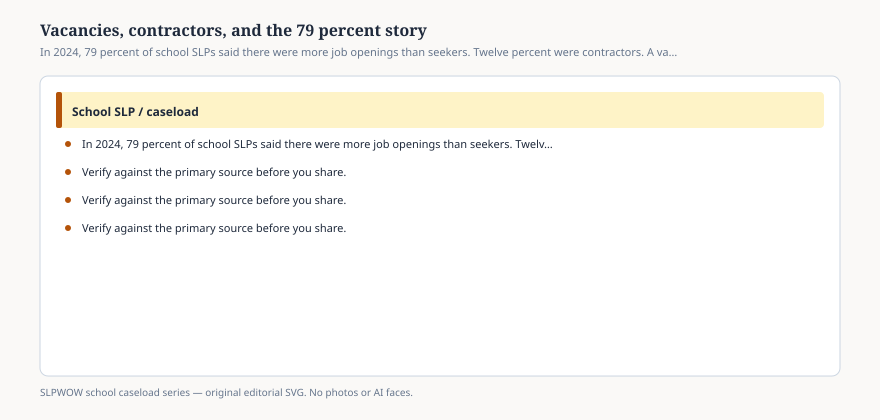

**Disclaimer.** Educational only. Not legal, billing, union, or clinical advice. Not a diagnosis and not a treatment protocol. This series does not use student records or any protected health information (PHI). Local IDEA, FERPA, Medicaid, and district rules govern practice. Talk with your district, a licensed speech-language pathologist, or counsel before changing services.

Seventy-nine percent of the school SLPs in ASHA’s 2024 workforce report said there were more job openings than job seekers in their facility type and area. That is a **perception** item about the market they could see. It is not BLS. It is not your HR dashboard. It is the sentence that sits under a lot of “nobody applied” stories, and it belongs next to two quieter numbers from the same wave: **12 percent** of employed respondents were contractors, **1 percent** were self-employed, and **86 percent** were salaried.

A vacancy, a contract, and a caseload are three objects. Headlines love to add them.

## What a vacancy is allowed to mean

<figure class="slpwow-figure slpwow-figure--infographic" itemscope itemtype="https://schema.org/ImageObject">
  
  <figcaption itemprop="caption">
    <strong>Figure 1.</strong> In 2024, 79 percent of school SLPs said there were more job openings than seekers. Twelve percent were contractors. A vacancy is not a caseload.
    SLPWOW school caseload series — original SVG. Not legal, billing, union, or clinical advice.
  </figcaption>
</figure>

An unfilled FTE is a hole in a staffing plan. The students attached to that hole did not become less eligible. They became someone else’s Tuesday, or no one’s. Make-up rules (essay 07) and compensatory-services procedures (essay 41) are how districts confess that fact later.

ASHA’s portal already lists recruitment and retention among the damages of large caseloads. The 2024 job-market item is the other direction: people who *have* jobs looking out and seeing openings. Those two sentences can both be true. A district can fail to fill a posting *and* overload the person who stayed.

Telepractice offices in the same workforce report were the most part-time setting (46 percent part time). Administrative offices were the most full-time (93 percent). Elementary, where most respondents sat, was 89 percent full time. If your local story is “we cannot find a full-time SLP for a rural elementary,” you are not contradicting the 79 percent. You are naming a slice the national item cannot see.

## What a contractor is doing in the building

Contractors are not a moral category. They are a labor arrangement. They may be covering a vacancy, a leave, a specialized evaluation, or a district that decided not to post a salaried line. They may be in the room every day or on a video cart twice a week.

The survey will not tell you whether the contractor has a key to the closet, access to the IEP system, or time to talk to the kindergarten team. Workload lives in those details. A contractor who cannot write in the official record creates a paperwork problem for the salaried person who can (essay 06). A contractor who *only* does direct minutes can look efficient on a invoice and still leave the indirect week on the floor.

CMS’s 2023 school-based Medicaid guide tells states not to pay school-based health contractors on a **contingency-fee** basis. That is a federal document about payment structure. It is not a rating of the clinician in the room. Essay 32.

## How to read a “we hired a company” story

Ask: is the story about **filling a vacancy**, **replacing a salaried line**, or **adding evaluation capacity**? Those are different budget moves.

Ask: who holds the IEP, who holds the Medicaid consent, who holds the FERPA record? “The company” is not an answer.

Ask: what happens in June? A contract that ends with the fiscal year is a vacancy with a calendar.

Ask: what did ASHA’s respondents in this *kind* of facility rank as their challenges? Paperwork first, everywhere. Workload/caseload second, usually. Personnel shortage ranked first among the 13 challenges only in the small student-home slice. In elementary it sat lower. A story that says “the only problem is hiring” has not read Table 1.

## What 79 percent cannot do

It cannot tell you the wage. The salary report is a different PDF in the same wave; this pack is not a compensation desk.

It cannot tell you to strike, to quit, or to take the contract. Essay 42 stays with retention *asks* as survey answers (half put a separate salary schedule in their top two), not as instructions.

It cannot put a student in the paragraph.

You can print the job-market item and the salaried/contractor split and take both to a board work session. You can keep caseload numbers on a different slide. You can refuse a billing step while you explain why a filled invoice is not a filled week.

The market item is a weather report. The IEP is still due.
