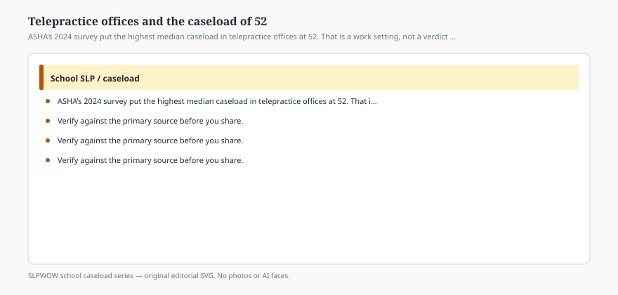

**Disclaimer.** Educational only. Not legal, billing, union, or clinical advice. Not a diagnosis and not a treatment protocol. This series does not use student records or any protected health information (PHI). Local IDEA, FERPA, Medicaid, and district rules govern practice. Talk with your district, a licensed speech-language pathologist, or counsel before changing services.

The highest median actual caseload in ASHA’s 2024 facility table sat in **offices for telepractice**: 52. Manageable, in the same row, was 45. Elementary was 51 and 45. Secondary 50 and 45. The national pair was 50 and 40.

Read the label. This is not “every remote session in America.” It is SLPs whose *employment facility* in the survey was a telepractice office — a company or district hub that delivers school services on a screen — as opposed to an elementary building that sometimes uses video when the itinerant cannot get through snow.

The workforce report adds a second fact about that row: telepractice offices were the most **part-time** setting (46 percent). Administrative offices were the most full-time (93 percent). A median caseload of 52 among people who may not even be full time is a different object from 52 in a single elementary FTE. The caseload table’s big medians were restricted to full-time clinical providers. Hold that restriction when you quote 52.

## What the setting is doing to the week

<figure class="slpwow-figure slpwow-figure--infographic" itemscope itemtype="https://schema.org/ImageObject">
  
  <figcaption itemprop="caption">
    <strong>Figure 1.</strong> ASHA’s 2024 survey put the highest median caseload in telepractice offices at 52. That is a work setting, not a verdict on remote service.
    SLPWOW school caseload series — original SVG. Not legal, billing, union, or clinical advice.
  </figcaption>
</figure>

Tech checks appear on the national activity list at a mean of **0.7 hours**. Anyone who has waited for a cart to boot knows that number is a national average, not a Monday in a building with one working camera. The telepractice office absorbs some of that friction as the job itself: platform, headsets, a school facilitator who is or is not in the room.

Facilitators are workload. So are no-shows that look like “student unavailable” (essay 07) and so is the documentation pile that did not get smaller because the session was remote (essay 06). FERPA still applies to the education record. A platform that records a session has created a record someone must house. Essay 33.

ASHA does not, in the portal pages this pack is using, crown telepractice as better or worse than pull-out. Service delivery is supposed to follow the student and the IEP, not the vendor. A model that exists because a vacancy could not be filled (essay 08) is a staffing story that happens to use a camera.

## How headlines get this row wrong

“Teletherapy means 52 kids, so remote is the problem.” The survey did not say that. It said the median in that *facility type* was 52. We do not have the mix: how many buildings per clinician, how many states, how many evaluation-only contracts.

“Telepractice is a small-caseload luxury.” Also false on this table. The luxury row, if you want to abuse the word, is special day/residential at 25 — and that 25 is a different intensity, not a spa (essay 12).

“ASHA says 45 is the telepractice cap.” ASHA said no such thing. 45 is the median *manageable* answer in that row.

## What to ask when your district “goes tele”

Is this a **temporary vacancy cover** or a **standing model**? Write it down.

Who is the **on-site adult**, and is that time in anyone’s workload?

Where does the **record** live, and who can a parent request it from?

Is the IEP’s **location of service** honest, or does it still say “speech room” because no one updated the page?

Are minutes being **grouped across schools** in ways the service page never described (essay 27)?

None of those questions needs a student name. All of them need an answer before a board votes a contract.

The 52 is a median in a row. Remote service is a location. Keep them in separate pockets, the way this series keeps caseload and workload in separate pockets. A camera does not erase IDEA. It also does not create a national cap.
