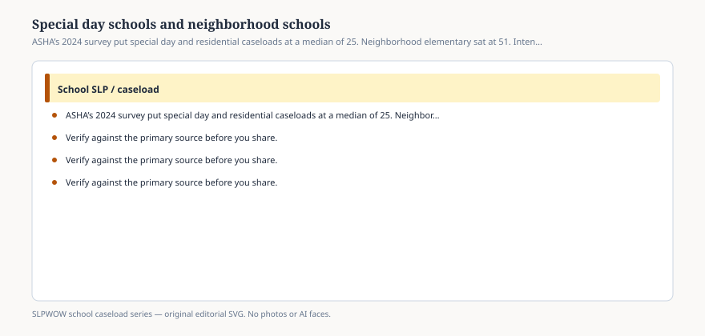

**Disclaimer.** Educational only. Not legal, billing, union, or clinical advice. Not a diagnosis and not a treatment protocol. This series does not use student records or any protected health information (PHI). Local IDEA, FERPA, Medicaid, and district rules govern practice. Talk with your district, a licensed speech-language pathologist, or counsel before changing services.

Special day and residential schools posted the lowest pair on ASHA’s 2024 facility table: median actual caseload **25**, median manageable **25**. Neighborhood elementary posted **51** and **45**. If you are a board member who only reads integers, you will ask why the “small” caseload needs a full-time SLP.

Because the integer is not intensity.

ASHA’s portal already says student needs vary and that a single number cannot carry the variation. This row is the exhibit. A 25-student caseload in a specialized setting is often AAC (nationally 74.5 percent of SLPs serve it), complex communication, feeding/swallowing for the few school SLPs who still hold that role (8.2 percent nationally; this series will not write a swallowing protocol), collaborative classroom service, and meetings that include more agencies than a neighborhood IEP. Manageable equals actual in that row. The people who answered did not describe a gap. They described a match — a hard match.

## What “special day / residential” is in the survey

<figure class="slpwow-figure slpwow-figure--infographic" itemscope itemtype="https://schema.org/ImageObject">
  
  <figcaption itemprop="caption">
    <strong>Figure 1.</strong> ASHA’s 2024 survey put special day and residential caseloads at a median of 25. Neighborhood elementary sat at 51. Intensity is not a spa day.
    SLPWOW school caseload series — original SVG. Not legal, billing, union, or clinical advice.
  </figcaption>
</figure>

It is a facility type, not a disability category. It includes public and nonpublic specialized schools and residential programs that employ SLPs. It is not a synonym for “self-contained classroom inside a neighborhood elementary.” Those students often sit on the elementary row’s 51.

LRE still applies. A specialized placement is a team decision, not an SLP brand. This essay does not argue for or against those placements. It argues against stealing the 25 to shame the 51, or stealing the 51 to shame the 25.

## What the neighborhood 51 is carrying

Related-service students whose primary category is not SLI. MTSS minutes that never got a disability label. Speech-sound groups. Language groups. The evaluation queue. Three buildings. A 504 meeting at 7:15. The integer looks twice the specialized row and may still under-count the week if MTSS is off the books (essay 19).

Paperwork ranked first in *both* facility types. The specialized SLP is not free of documentation because the caseload is smaller. The neighborhood SLP is not “less skilled” because the caseload is larger. Those are both insults dressed as math.

## How administrators misuse the pair

“Move two days from the special school to the elementary; they only have 25.” You have just treated intensity as empty chairs.

“The special school is overstaffed relative to ASHA’s median of 50.” ASHA’s 50 is a national median across settings, driven by elementary n. Using it as a target for a specialized program is the same error as using 25 as a target for a neighborhood program.

“Parents will think 25 is a luxury.” Then show them the four workload clusters and the intervention mix, without naming a child. AAC mean among those who serve it is 7.2 students — and those students are not evenly spread. They concentrate.

## A clean comparison for a packet

Three columns: facility type, 2024 median actual / manageable, and a local **mix** line (percent AAC, percent related service, buildings per FTE, open evaluations). No student names. No photographs.

If the specialized program’s mix is heavy and the median is 25/25, the survey is on your side *as description*, not as a staffing formula.

If the neighborhood program’s mix is light and the median is 70 against a statewide 51, you have a different conversation — caseload, vacancy, or both.

LRE is a legal requirement to educate with peers to the maximum extent appropriate. It is not a requirement that every SLP carry the national median. The two rows on ASHA’s table are the reminder that “school SLP” is not one job.
