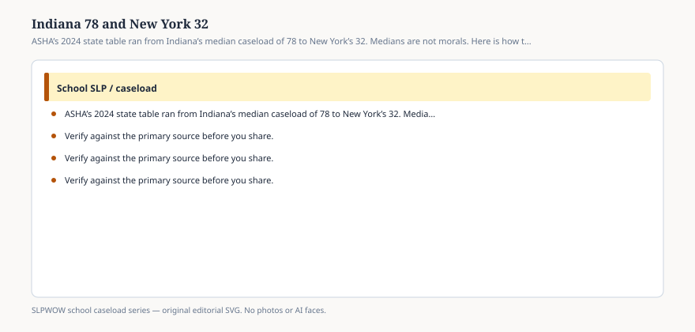

**Disclaimer.** Educational only. Not legal, billing, union, or clinical advice. Not a diagnosis and not a treatment protocol. This series does not use student records or any protected health information (PHI). Local IDEA, FERPA, Medicaid, and district rules govern practice. Talk with your district, a licensed speech-language pathologist, or counsel before changing services.

Table 1 of the 2024 caseload report is a map that refuses to be a morality play. Among the 32 states with at least 25 respondents in the actual column, the high edge is **Indiana, 78**. The low edge is **New York, 32**. Manageable in those two cells: 50 and 30. The gaps are 28 students and 2 students.

A feed that says “Indiana fails children” or “New York has it solved” has left the PDF. A median is what certified people in the sample reported as a monthly caseload. It is not an audit of FAPE. It is not a ranking of kindness.

## What the table will let you say

<figure class="slpwow-figure slpwow-figure--infographic" itemscope itemtype="https://schema.org/ImageObject">
  
  <figcaption itemprop="caption">
    <strong>Figure 1.</strong> ASHA’s 2024 state table ran from Indiana’s median caseload of 78 to New York’s 32. Medians are not morals. Here is how to read the edges.
    SLPWOW school caseload series — original SVG. Not legal, billing, union, or clinical advice.
  </figcaption>
</figure>

You may say the reportable range of *state medians* ran from 32 to 78. You may say Indiana’s respondents described the largest drop from actual to manageable (28). You may say New York and Arkansas described the smallest drops (2 and 1). You may say Connecticut and New York tied for the smallest manageable median (30), and that seven states put manageable at 50.

You may say Texas sat at 65 actual / 50 manageable, Tennessee at 63 / 50, Florida and Kentucky at 60 / 50, Louisiana at 60 / 43. You may say Massachusetts and Arkansas sat at 40 actual. You may say Illinois sat at 45 / 40, Wisconsin at 42 / 35, New Jersey at 45 / 35.

You may not fill a blank cell. Alaska, Hawaii, Maine, and a list of others did not meet n = 25. Blank is “not enough answers,” not “zero caseload.”

You may not average two neighboring states to invent a third.

## What the edges are not

They are not proof that New York’s statute is the model. They are not proof that Indiana’s respondents are less dedicated. They are not a reason to move your family. They are not a student.

Regional figures sit behind the state table. Two regions posted actual medians of 58. Two posted 40. New England’s manageable median was 31. Middle Atlantic actual sat low relative to East North Central. If you quote a region, name it. Do not say “the Midwest” if you mean Indiana.

Population density did **not** move the national 50 / 40 pair. An Indiana-versus-New-York story that is secretly a rural-versus-city story is not this table’s story.

## How a state number gets used in a meeting

A superintendent in a high-median state: “We are near the state median.” That can be true and still be a bad week. Medians describe the middle of *respondents*, not the legal standard.

A union in a low-median state: “We cannot complain; look at Indiana.” Workload is local. Paperwork still ranked first in every facility type, including wherever those New York respondents sat.

A legislator: “Set the cap at the national 50.” Essay 05. ASHA still will not bless a number. A cap copied from a survey median will be a floor by October.

## A way to hold both edges

Print the two cells. Print the n rule. Print your district’s own October count next to them — headcount *and* a workload list, no names. Ask which object you are trying to move: statute, vacancy, minutes, or documentation hours.

If you live in a state that is blank on Table 1, you are not invisible. You are under-sampled. Use the national pair and your local data.

Indiana 78 and New York 32 are useful because they kill the fantasy of one American caseload. They are harmful when they become a taunt. This desk will keep them as edges of a table.
