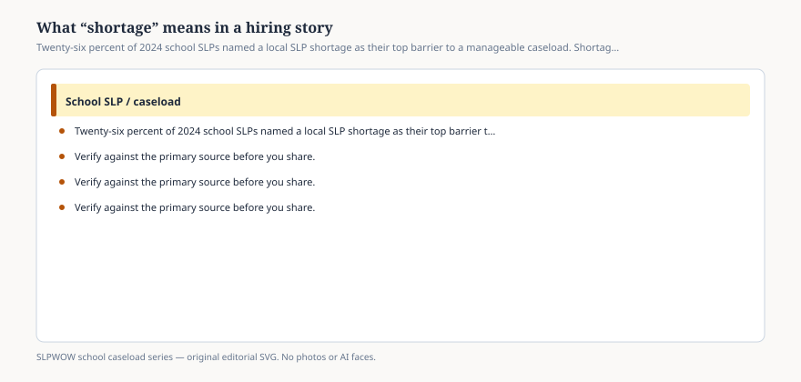

**Disclaimer.** Educational only. Not legal, billing, union, or clinical advice. Not a diagnosis and not a treatment protocol. This series does not use student records or any protected health information (PHI). Local IDEA, FERPA, Medicaid, and district rules govern practice. Talk with your district, a licensed speech-language pathologist, or counsel before changing services.

When ASHA asked clinical providers for their **single greatest barrier** to a manageable caseload, the plurality answer was not paperwork. Paperwork won the separate 13-challenge ranking. On the barrier item, **26 percent** said a shortage of SLPs in their area. **24 percent** said there was no barrier. After that: lack of administrative support (12), difficulty dismissing (10), district or state policy (10), parent resistance (4), shortage of assistants (1), and other (15).

“Shortage” is doing a lot of work in that 26 percent. A hiring story that uses the word once is usually using it for three different missing things.

## Three shortages that share a noun

<figure class="slpwow-figure slpwow-figure--infographic" itemscope itemtype="https://schema.org/ImageObject">
  
  <figcaption itemprop="caption">
    <strong>Figure 1.</strong> Twenty-six percent of 2024 school SLPs named a local SLP shortage as their top barrier to a manageable caseload. Shortage is several different shortages.
    SLPWOW school caseload series — original SVG. Not legal, billing, union, or clinical advice.
  </figcaption>
</figure>

**A body shortage.** The posting is up. Nobody acceptable applied. The 79 percent who saw more openings than seekers (essay 08) live here. So do visa delays, a rural drive, and a salary schedule that loses to the clinic across town (essay 42).

**A credentials shortage.** People applied. They cannot be the provider of record in this state, or the district will not accept the CF, or the SLPA cannot take the work the vacancy actually is (essay 31). The 1 percent who named a shortage of assistants are a small slice with a loud local reality.

**A week shortage.** The FTE exists. The week does not. Evaluations, Medicaid logs, four buildings, and a make-up rule have eaten the minutes that would have made 50 look like 40. This is the shortage ASHA’s workload page has been describing since 2002. Hiring another person would help. So would retiring a double documentation system. Those are different purchase orders.

A headline that says “state faces SLP shortage” without saying which of the three will get you a task force that trains nobody for the job you actually have.

## What the barrier item is not

It is not a count of unfilled positions. ASHA did not audit postings.

It is not proof that dismissal is “the real problem” — though 10 percent said it was *their* top barrier, and they deserve essay 21.

It is not proof that parents are the problem. Four percent said parent resistance. Do not inflate them into a culture war.

It is not a reason to skip MTSS or to refuse an evaluation. A shortage does not amend IDEA.

## How to read your local story

Ask for the **posting age**, the **number of qualified applicants**, and the **salary band** next to the neighboring district and the local clinic. If applicants exist and the offer loses, you have a price story wearing a shortage hat.

Ask whether the vacancy is **full-time in one building** or 0.4 FTE across three. People can refuse a fraction without proving a national drought.

Ask whether “we hired telepractice” is a **cover** or a **conversion** (essay 10).

Ask whether the remaining SLP’s caseload absorbed the hole. If yes, the 26 percent and the 50-versus-40 gap (essay 04) are in the same building.

Personnel shortage ranked **first** among the 13 challenges only in the small student-home slice of the workforce table. In elementary it was not first. A story that treats every building as a desert has not read the facility split.

## A sentence that stays honest

*In ASHA’s 2024 caseload report, 26 percent of school SLPs named a local SLP shortage as their single greatest barrier to a manageable caseload, and 24 percent named no barrier. The workforce report’s job-market item found 79 percent seeing more openings than seekers. Those are member-survey items, not a vacancy census. Shortage may mean bodies, credentials, or hours.*

You can take that sentence to a board. You can refuse to put a child on the slide. You can still want the posting filled.

The word is allowed. The blur is not.
