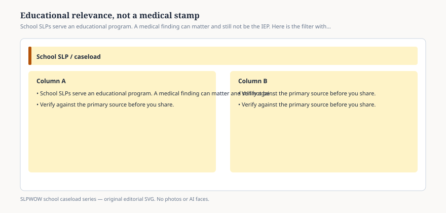

**Disclaimer.** Educational only. Not legal, billing, union, or clinical advice. Not a diagnosis and not a treatment protocol. This series does not use student records or any protected health information (PHI). Local IDEA, FERPA, Medicaid, and district rules govern practice. Talk with your district, a licensed speech-language pathologist, or counsel before changing services.

A clinic can name a condition. A school has to name an **educational program**.

Those sentences can describe the same child and still not describe the same document. The medical report may be part of an evaluation. It is not, by itself, an IEP. The IEP has to say how the student is doing in the curriculum and in the life of the building, what will change this year, and how anyone will know (essays 22, 23, 29). *Endrew F.* is about that program, not about a billing diagnosis.

ASHA’s 2010 school-roles document leaned on **educational relevance** because the closet model had drifted. Goals that only an SLP could observe, written in a dialect teachers do not speak, were failing the statute even when they looked “clinical.”

## A filter, not a brush-off

<figure class="slpwow-figure slpwow-figure--infographic" itemscope itemtype="https://schema.org/ImageObject">
  
  <figcaption itemprop="caption">
    <strong>Figure 1.</strong> School SLPs serve an educational program. A medical finding can matter and still not be the IEP. Here is the filter without a diagnosis.
    SLPWOW school caseload series — original SVG. Not legal, billing, union, or clinical advice.
  </figcaption>
</figure>

Educational relevance is not “we only work on /r/ if it is on the state test.” It is: does this communication need change the student’s access to instruction, to peers, to the vocational or social demands of the grade?

A voice that cannot last a class period is educational. A fluency pattern that keeps a student from presenting is educational. A language disability that wrecks word problems is educational. AAC that is not up to date is educational *and* a workload item (essay 38).

A finding that lives only in a clinic note — a mild structural issue with no classroom effect, a history that has resolved — may still deserve a conversation with the family and the physician. It may not deserve minutes. The team says so. The blog does not.

The rude version of the filter is “not educational, go away.” The accurate version is “here is what we see at school; here is what the clinic owns; here is 504 if accommodations without specialized instruction are the fit; here is MTSS if we are still teaching the building to teach” (essay 19).

## Medicaid does not flip the filter

School-based Medicaid (essay 32) can reimburse covered services delivered at school. It does not convert the SLP into a hospital department. CMS’s 2023 guide is about payment and administrative claiming. IDEA is about FAPE. When the two overlap, districts grow extra paperwork (essay 06). They should not grow a second set of *goals* that exist only to bill.

If a service is on the IEP because it is required for FAPE, the educational filter already ran. If someone wants a service *only* because it is billable, you have left this essay and entered a compliance problem.

## How caseload fights fake the filter

“Everything is educational” is how you get a 78-student month and a week that cannot meet *Endrew F.* for anyone.

“Almost nothing is educational” is how you get a quiet caseload and a due-process file.

The 2024 intervention table is a picture of what school SLPs already serve. It is not a mandate to serve every row for every student. Literacy at 28 percent of SLPs is a reminder that some buildings have decided reading is inside the role and some have not (essay 37). That decision should be a program-design decision, not a midnight add-on.

## Language for a meeting

*The school’s job is an educationally relevant program. A medical report can inform the evaluation. It does not replace present levels, goals, or the team’s eligibility finding. We will not diagnose from this table.*

You can say that with the 2010 roles summary on the table. You can refuse a protocol. You can refuse to name a child.

The stamp the school owns is the IEP. The stamp the clinic owns stays at the clinic unless the team invites it in as data.
