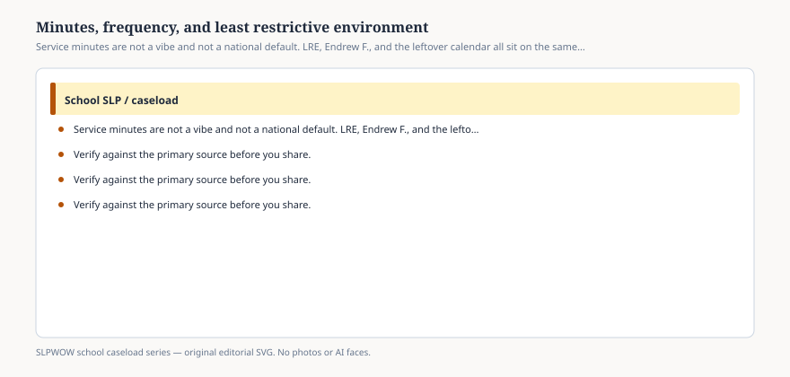

**Disclaimer.** Educational only. Not legal, billing, union, or clinical advice. Not a diagnosis and not a treatment protocol. This series does not use student records or any protected health information (PHI). Local IDEA, FERPA, Medicaid, and district rules govern practice. Talk with your district, a licensed speech-language pathologist, or counsel before changing services.

“Thirty minutes, twice a week, pull-out” is a habit that got printed so often it started to look like a regulation.

It is not. ASHA’s school-services FAQ says the Association does not recommend one service-delivery model over another. Models should be dynamic and combined as needs change. Brandel and Loeb (2011) and later work, cited on the caseload portal, found that **caseload size** often drives intensity and model more than student characteristics do. That sentence is the quiet scandal inside a lot of service pages.

This essay will not prescribe minutes. It will name the three objects that have to fit on one line: the **educational need**, the **LRE**, and the **week that actually exists**.

## What the service page is promising

<figure class="slpwow-figure slpwow-figure--infographic" itemscope itemtype="https://schema.org/ImageObject">
  
  <figcaption itemprop="caption">
    <strong>Figure 1.</strong> Service minutes are not a vibe and not a national default. LRE, Endrew F., and the leftover calendar all sit on the same line.
    SLPWOW school caseload series — original SVG. Not legal, billing, union, or clinical advice.
  </figcaption>
</figure>

Frequency, duration, and location tell a parent what FAPE looks like this year. They tell a make-up policy what to chase (essay 07). They tell a compensatory-services conversation what was missed (essay 41). If the page says 60 minutes a week and the schedule delivers two groups of 20 with six other students, the page is fiction.

Indirect services belong on the page when they are real. ASHA’s 3:1 examples (essay 26) only work if the IEP says that one week in four is observation, collaboration, and planning *for this student*. A parent who never heard of the indirect week did not consent to a surprise.

## LRE is a location argument

Least restrictive environment is the duty to educate with peers to the maximum extent appropriate, with supplementary aids and services. Pull-out is a removal for a slice of the day. It can be the right slice. It has to be *the student’s* slice, not the closet’s availability.

Push-in and classroom-based service (essay 28) can be less restrictive *or* more chaotic. A classroom where the SLP becomes a floating aide is not automatically LRE; it can be a waste of the only specialized minutes. Consult that never reaches the student is not LRE; it is a meeting.

Secondary LRE fights the bell (essay 11). Elementary LRE fights the idea that all speech is a group in the portable. Specialized settings fight the assumption that 25 students means 25 light weeks (essay 12).

## Endrew F. does not print 30 × 2

Appropriate progress in light of circumstances might mean a burst of intensive service and then a fade. It might mean consult-only for a quarter. It might mean daily classroom language. The Court gave a standard, not a grid. A district grid that assigns the same minutes to every speech student is the de minimis problem in scheduling form.

## The leftover calendar

If the only open block is Thursday at 2:40, that is not an individualized determination. It is leftover. Workload analysis exists to show a principal that leftover is now the design (essay 43). Adding students to leftover is how 50 becomes 78 without anyone voting.

Group size is part of minutes. Four students in 30 minutes is 7.5 minutes each if you are crude, and not even that if the goals do not match (essay 27). Write the group as a group if it is a group. Do not write individual minutes you cannot deliver.

## Language for the table

*We chose this frequency and location because of these present levels, not because the slot was open. If the week changes, the page should change.* No student name in the public version of that sentence.

You can refuse a default. You can refuse a protocol that tells you how to spend the 30 minutes. You can still believe in 30 minutes when it is the right 30.

The line on the IEP is a promise. Treat it like one.
