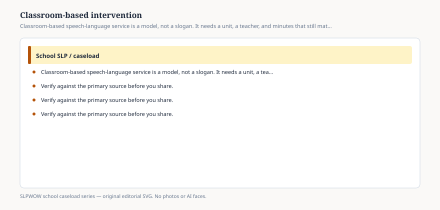

**Disclaimer.** Educational only. Not legal, billing, union, or clinical advice. Not a diagnosis and not a treatment protocol. This series does not use student records or any protected health information (PHI). Local IDEA, FERPA, Medicaid, and district rules govern practice. Talk with your district, a licensed speech-language pathologist, or counsel before changing services.

The classroom is not automatically the least restrictive place for a specialized minute. It is the place the curriculum lives.

ASHA’s portal cites classroom-based and co-taught language lessons (Gillam and colleagues among the trail) as something students may benefit from — and then says large caseloads steal the time to do them. That pair of sentences is the whole implementation problem.

Classroom-based intervention, in this pack, means the SLP’s service is designed around a unit the class is already in: the language of the lab, the retell of the week’s text, the vocabulary of the social-studies claim. It is not “I sat in the back and whispered.” It is not “I ran my closet lesson on the carpet.” Those are location changes without a model change (essay 25).

## What has to be true before you walk in

<figure class="slpwow-figure slpwow-figure--infographic" itemscope itemtype="https://schema.org/ImageObject">
  
  <figcaption itemprop="caption">
    <strong>Figure 1.</strong> Classroom-based speech-language service is a model, not a slogan. It needs a unit, a teacher, and minutes that still match the IEP.
    SLPWOW school caseload series — original SVG. Not legal, billing, union, or clinical advice.
  </figcaption>
</figure>

**A shared plan.** The teacher knows you are coming, what the unit is asking students to *do with language*, and which students have IEP minutes in this block. FERPA still applies; you do not announce eligibility to the room (essay 33).

**A goal that can be seen here** (essay 23). If the goal can only be scored on a probe in the closet, you are in the wrong room or you have the wrong goal.

**Minutes that match the page.** If the IEP says pull-out, you are rewriting without a meeting. If the IEP says classroom, the classroom has to happen.

**A job that is not aide work.** Collecting pencils is not specialized instruction. Leading a language routine the teacher will run tomorrow can be.

## What the 2010 roles document was pushing

Curriculum-relevant intervention, prevention, and collaboration with general educators. The science-of-reading wave (essay 37) made that push louder for language and literacy. It did not make every SLP the reading teacher. It did make closet-only language goals harder to defend in buildings that finally noticed sentences.

Secondary classrooms (essay 11) are the hard case: you cannot sit in six periods. Consult plus a targeted push-in to the class where the present level lives is often the adult version of “classroom-based.” Elementary is the tempting case: one teacher, one unit, five students with language goals. Tempting is not the same as staffed.

## Workload accounting

Classroom-based work spends the indirect clusters: planning with the teacher, preparing materials that match the unit, sometimes programming AAC with classroom vocabulary (essay 38). If you only count the 30 minutes in the room, you will conclude the model is “inefficient” and go back to the portable. The portal’s four clusters exist to stop that math.

The 3:1 indirect week (essay 26) can be the planning. Direct weeks can be the classroom. Write it.

## How it fails in public

A video of a smiling SLP on a rug with no plan. A principal who thinks presence equals inclusion. A parent who never heard the location changed. A group that is actually a pile at the kidney table (essay 27).

## Language for the team

*We are using the classroom because the goal is the language of this unit. The specialized minute is [X]. The teacher’s part is [Y]. If that falls apart, we come back to the table.*

No protocol for the language routine in this essay. No student name.

A walk-through without a unit is tourism. A unit without a walk-through is a closet lesson that moved furniture. Pick one on purpose, write the location, and let the teacher keep the room when you leave.

The classroom is the curriculum’s house. Rent a room on purpose or stay out.
