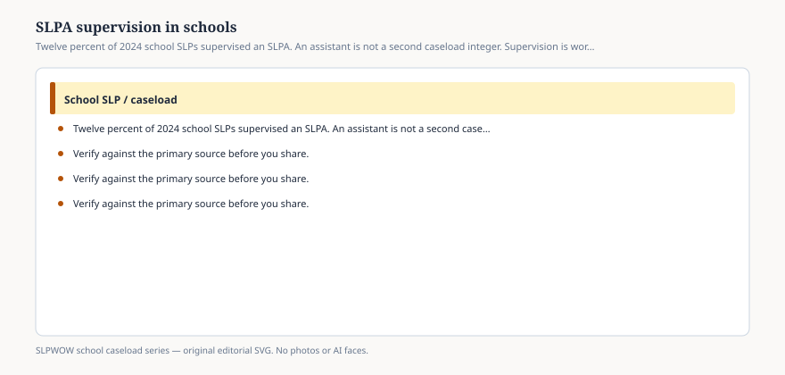

**Disclaimer.** Educational only. Not legal, billing, union, or clinical advice. Not a diagnosis and not a treatment protocol. This series does not use student records or any protected health information (PHI). Local IDEA, FERPA, Medicaid, and district rules govern practice. Talk with your district, a licensed speech-language pathologist, or counsel before changing services.

Twelve percent of the school SLPs in ASHA’s 2024 workforce report supervised a speech-language pathology assistant. The caseload report’s activity list put supervision at a mean of **1.1 hours** a week across *all* full-time clinical providers, most of whom were not supervising anyone. The people in the 12 percent are not living in that mean.

An SLPA is not a second SLP. An SLPA is not free caseload. Supervision is a workload cluster of its own: planning, observing, signing, training, and remaining the provider of record for the IEP. ASHA’s portal already lists limited time to train support personnel among the damages of large caseloads. Hiring an assistant into a 78-student month without adding supervisor hours is how you get two people and still one impossible week.

This essay will not reprint state SLPA statutes. They differ on scope, supervision ratios, and whether an assistant may be alone in a building. Open yours. Open ASHA’s assistant code of conduct and the school-roles document. Then open the IEP.

## What the IEP still needs

<figure class="slpwow-figure slpwow-figure--infographic" itemscope itemtype="https://schema.org/ImageObject">
  
  <figcaption itemprop="caption">
    <strong>Figure 1.</strong> Twelve percent of 2024 school SLPs supervised an SLPA. An assistant is not a second caseload integer. Supervision is workload.
    SLPWOW school caseload series — original SVG. Not legal, billing, union, or clinical advice.
  </figcaption>
</figure>

A provider of record who can assess, interpret, write present levels, and stand at the table. Assistants, where lawful, may deliver assigned services. They do not become the eligibility decider. They do not become the person who independently redesigns the goal. If a parent only ever meets the assistant, the district has a communication problem and possibly a supervision problem.

Minutes delivered by an SLPA still have to match the page (essay 24). Make-ups still have a clock (essay 07). FERPA still applies to what the assistant writes (essay 33).

## What “1 percent named assistant shortage” is telling you

On the barrier item, only 1 percent said a shortage of assistants or aides was their *greatest* barrier. That does not mean assistants are everywhere. It means, among six listed barriers plus “other,” most people pointed at SLP shortage, administration, dismissal, or policy first (essay 14). In a building that already has an SLPA line and cannot fill it, that 1 percent is the whole weather.

## How administrators misuse the 12 percent

“Other districts have assistants; add one and we can raise your cap.” The 2002 position statement still refuses a cap. An assistant changes the *mix* of who delivers minutes. It does not erase evaluations, IEPs, or Medicaid documentation.

“Supervision is just a signature.” Then you do not have supervision. You have a risk.

“The assistant can take the complex AAC.” Scope of practice and training say otherwise more often than a schedule does. AAC is already a workload item for the SLP (essay 38).

## How to put it on a principal page

Two lines: number of SLPA hours, number of supervisor hours actually calendared (not the 1.1 national smear). Then the four clusters. No student names.

If the assistant is covering a vacancy (essay 08), say that. A cover is not a program design.

You can refuse a protocol for what the assistant should run. You can refuse to invent a named assistant or student.

The national 1.1-hour supervision mean is diluted by people who supervise no one. Budget the real hour, not the smear. If the assistant is the only adult families meet, schedule the SLP at the table on purpose. If the assistant is the only adult in a building, open the state supervision rule before you call that a model. Availability is not the same as lawful presence.

The 12 percent is a description of who already holds the extra hour. The hour still has to exist. You cannot supervise a ghost, and you cannot supervise a full caseload in a signature block.
