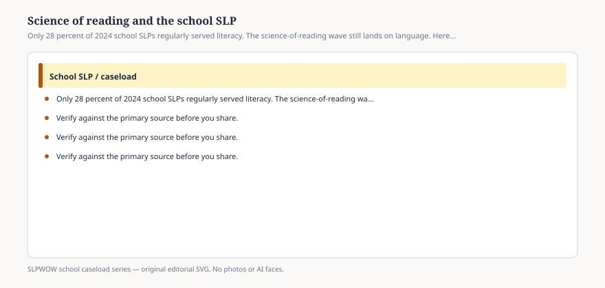

**Disclaimer.** Educational only. Not legal, billing, union, or clinical advice. Not a diagnosis and not a treatment protocol. This series does not use student records or any protected health information (PHI). Local IDEA, FERPA, Medicaid, and district rules govern practice. Talk with your district, a licensed speech-language pathologist, or counsel before changing services.

Twenty-eight percent of the school SLPs in ASHA’s 2024 caseload report said they regularly serve students in **reading and writing (literacy)**. Among those who do, the mean number of students was **14.8** — a pile as large as the autism mean (14.2) and larger than the AAC mean (7.2).

Read both facts. Most school SLPs did *not* check the literacy box. The ones who did are carrying a caseload-sized reading load on top of the language and speech-sound piles that 90 percent carry. A news story that says “SLPs will now own the science of reading” has not read Table 2.

A news story that says “speech has nothing to do with reading” has not read ASHA’s written-language portal or the 2010 roles document.

## What the wave is

<figure class="slpwow-figure slpwow-figure--infographic" itemscope itemtype="https://schema.org/ImageObject">
  
  <figcaption itemprop="caption">
    <strong>Figure 1.</strong> Only 28 percent of 2024 school SLPs regularly served literacy. The science-of-reading wave still lands on language. Here is the lane without a reading protocol.
    SLPWOW school caseload series — original SVG. Not legal, billing, union, or clinical advice.
  </figcaption>
</figure>

State dyslexia laws, curriculum adoptions, and a public argument about phonics have changed what principals want from every adult who touches language. The National Reading Panel (2000) is the old document people still name. The new documents are *state* pages. Cite the one in your hand. `[VERIFY]` before a live post names a statute.

Science of reading, as a phrase, is not a protocol this blog will print. It is a policy weather system. SLPs stand in it because spoken language, phonological awareness, vocabulary, and discourse are already the job — even when the data system files them under “language: semantics, morphology, syntax” (90.2 percent) instead of “literacy” (28 percent).

## The lane

**In the lane:** the language under the print. Morphology that changes meaning. Syntax that makes a sentence a sentence. Discourse that makes a paragraph a claim. Phonological awareness as *language*, not as a secret reading program. Written-language disorders as an ASHA clinical topic with a portal, not a brand.

**Out of the lane:** becoming the building’s unfunded reading specialist. Running a commercial phonics package you were not trained or assigned to run. Diagnosing dyslexia from this URL. Promising that speech minutes will “fix reading.”

MTSS reading tiers (essay 19) may want SLP consult. They may not delay a special-education evaluation. They may not dump a caseload of 51 onto one person who checked a box.

## How caseload fights the wave

If literacy is added to the role without being added to the FTE, you have the 2002 problem again: roles expand, integer stays. The portal already listed literacy facilitation among workload drivers.

If literacy is *forbidden* to the SLP because “that’s Title I,” you get closet language goals that ignore the block where language is being taught (essay 23). Teachers then invent a dump (essay 34).

Secondary SLPs who never checked the literacy box still sit in the language of lab reports (essay 11). The checkbox is not the whole truth.

## Language for a curriculum meeting

*Twenty-eight percent of ASHA’s 2024 school SLPs reported regularly serving literacy; ninety percent reported serving language form and content. We will work the language under the print. We will not take a reading contract this blog did not staff. We will not diagnose dyslexia here.*

You can print the written-language portal for clinicians. You can print nothing that looks like a home reading program.

Spoken language is already in the 90 percent row. Print is the 28 percent row. Confusing those rows is how a building assigns a second job without a second FTE. If a curriculum map never lists the SLP and still wants the SLP at every reading meeting, you have an unfunded invitation. Answer with the 28 / 90 pair, not with a yes that adds fourteen students to a week that already had fifty.

The wave is real. The checkbox is 28 percent. The language pile is 90. Staff the difference.
