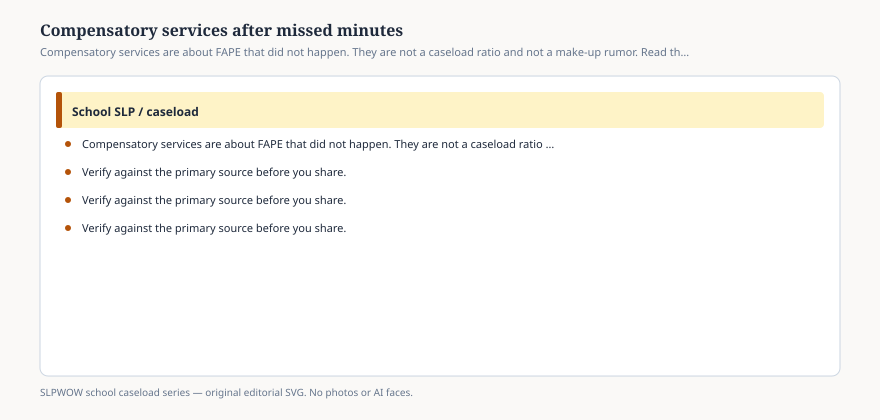

**Disclaimer.** Educational only. Not legal, billing, union, or clinical advice. Not a diagnosis and not a treatment protocol. This series does not use student records or any protected health information (PHI). Local IDEA, FERPA, Medicaid, and district rules govern practice. Talk with your district, a licensed speech-language pathologist, or counsel before changing services.

When the minutes did not happen, the headline still says *caseload*. The legal object is usually **FAPE**.

Compensatory services — sometimes called compensatory education — are what a district may owe when a student did not receive the special education or related services the IEP required. They are not a ratio bill (essay 05). They are not the 37 percent who must always make up a session (essay 07). They are not a vacancy story, though a vacancy is how a lot of them begin (essay 08).

This essay will not tell you a student is owed hours. It will not write your district’s procedure. It will keep the three clocks apart.

## Make-up versus compensatory

<figure class="slpwow-figure slpwow-figure--infographic" itemscope itemtype="https://schema.org/ImageObject">
  
  <figcaption itemprop="caption">
    <strong>Figure 1.</strong> Compensatory services are about FAPE that did not happen. They are not a caseload ratio and not a make-up rumor. Read the procedure.
    SLPWOW school caseload series — original SVG. Not legal, billing, union, or clinical advice.
  </figcaption>
</figure>

**Make-up** is the local rule for a missed session in an otherwise running program: snow, absence, a sick provider, a fire drill. The 2024 survey only asked whether make-up was *required*, and how often. It did not ask whether anyone received compensatory services.

**Compensatory** is the remedy conversation: a pattern, a vacancy that lasted a quarter, a service that was written and never staffed, a hearing decision, a state-complaint agreement. ED and courts have treated it as a way to put the student in the position they would have been in if FAPE had been delivered. The details are local and legal. Counsel owns them.

Using “we’ll make it up in May” as a substitute for a compensatory decision is how you get a summer that eats the next year’s week.

## What *Endrew F.* is doing in this paragraph

The Court did not invent compensatory services. It did say the program must be reasonably calculated for appropriate progress, not trivial progress. A year of missing related-service minutes is a hard thing to call calculated. A year of *documented* progress despite a vacancy is a different file. Neither file belongs on a blog.

## How headlines blur the object

“Parents sue over caseloads.” Read the complaint. If the prayer for relief is hours of service, you are in this essay. If it is a statute capping students, you are in essay 05. If it is a hire, essay 08.

“District offers Saturday speech.” Ask whether that is make-up, compensatory, or a PR day. Ask whether the IEP was amended. Ask who is the provider of record.

“AI will document the missed minutes.” Documentation of a hole is not the filling of the hole (essay 40).

## Workload after the letter

Compensatory hours land on someone’s calendar. If they land on the same FTE that already has 51 students, you have stacked the remedy on the injury. A principal brief should say that without naming the student (essay 43).

Groups that absorb compensatory students become piles (essay 27). Telepractice covers (essay 10) need an honest location line.

## Language for a family — still not advice

*Ask for the IEP service page, the attendance of the service, and the district’s written procedure for missed related services and compensatory services. You may bring an advocate. This series is not your advocate and will not name a child.*

You can print IDEA’s public site. You can refuse a billing step. You can refuse a protocol for “intensive catch-up.”

The 37 percent who must always make up a session are not automatically in a compensatory process. Do not use the survey to skip the procedure. If the only plan is “we will try to see them more in May,” you do not have a remedy. You have a hope with a month attached. Hope is not a procedure, and May is already someone else’s IEP.

The remedy is a legal object. The integer is not. Keep the clocks labeled.
