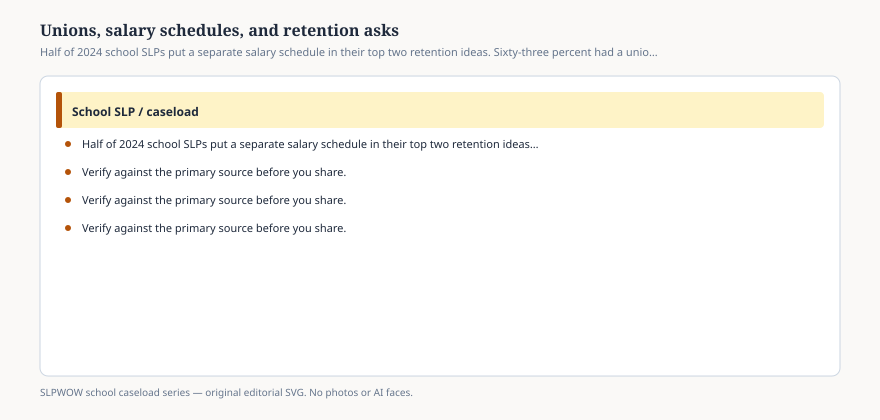

**Disclaimer.** Educational only. Not legal, billing, union, or clinical advice. Not a diagnosis and not a treatment protocol. This series does not use student records or any protected health information (PHI). Local IDEA, FERPA, Medicaid, and district rules govern practice. Talk with your district, a licensed speech-language pathologist, or counsel before changing services.

Fifty percent of the school SLPs in ASHA’s 2024 workforce report included **placing SLPs on a separate salary schedule from teachers** as one of their top two suggestions for retaining school-based SLPs. Sixty-three percent said union representation was **available** in their districts — available, not “I am a member,” not “I will vote yes.”

This essay will not tell you to join, resign, strike, or cross a line. It will treat those two numbers as **survey answers** next to the burnout items (34 percent considering a setting change; 27 percent considering leaving) and the job-market item (79 percent seeing more openings than seekers).

## Why a separate schedule shows up

<figure class="slpwow-figure slpwow-figure--infographic" itemscope itemtype="https://schema.org/ImageObject">
  
  <figcaption itemprop="caption">
    <strong>Figure 1.</strong> Half of 2024 school SLPs put a separate salary schedule in their top two retention ideas. Sixty-three percent had a union available. This is a survey, not a vote.
    SLPWOW school caseload series — original SVG. Not legal, billing, union, or clinical advice.
  </figcaption>
</figure>

School SLPs are often paid on the teacher scale even when the calendar, the credential, the Medicaid log, and the liability do not match the teacher next door. Clinics and medical settings post different numbers — the salary PDF in the same ASHA wave is the desk for that comparison; this pack is not reprinting wages that go stale.

A separate schedule is one retention idea. It is not ASHA policy in the 2002 workload sense. It is not a promise it will cut caseload. People can want to be paid as the market and still need a workload analysis (essay 02).

## What “union available” is not

It is not 63 percent representation. It is not a ranking of states. Appendix C of the workforce report splits availability by facility; open it if you need the row. Telepractice offices and student-home settings will not look like elementary.

It is not a reason for this brand to take a side in a contract fight. It is a reason a reporter should ask *which* contract covers related-service providers, and whether contractors (12 percent) sit outside it (essay 08).

## Retention is more than money

The same respondents ranked paperwork first and caseload/workload second. A raise that leaves the double log and the four buildings will keep the 27 percent in the “considering” column. A workload hire that loses to the clinic’s wage will keep the 79 percent looking at openings.

ASHA’s portal already tied large caseloads to recruitment and retention. The 2024 items are the member voice on top of that literature.

Other retention ideas exist. The survey asked; this pack is not a bargaining table and will not invent a ranked list beyond the 50 percent sentence ASHA printed in the executive summary.

## How to quote it without campaigning

*In the 2024 Schools Survey workforce report, 50 percent of school SLPs put a separate salary schedule from teachers in their top two retention suggestions, and 63 percent said a union was available in their district. Thirty-four percent were considering a setting change because of burnout. These are member-survey items, not a vote and not legal advice.*

You can print the executive summary. You can refuse to tell anyone how to vote. You can refuse a student photograph next to a labor headline.

This pack will not reprint a wage that will be stale by the next even-year survey. Eighty-six percent of the same wave were salaried; twelve percent were contractors. A retention idea that only sees the teacher scale will miss the invoice. If a reporter wants a quote about a strike, send them to the local unit and to counsel. If a principal wants this URL to settle a salary conversation, send them to the workforce PDF’s executive summary and to HR. This desk will not split the difference.

The asks are data. The contract is local. The blog is neither.
