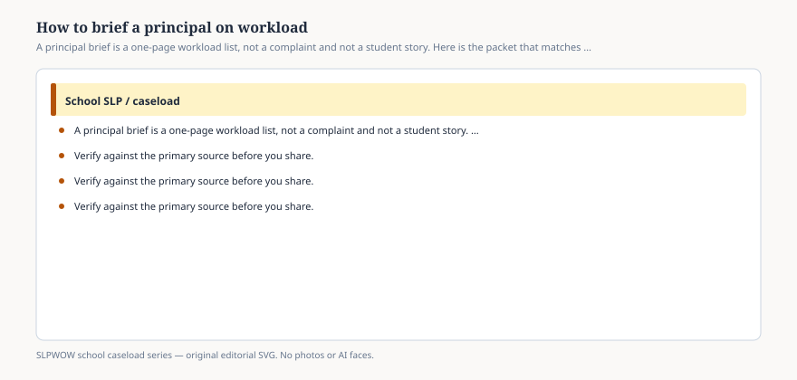

**Disclaimer.** Educational only. Not legal, billing, union, or clinical advice. Not a diagnosis and not a treatment protocol. This series does not use student records or any protected health information (PHI). Local IDEA, FERPA, Medicaid, and district rules govern practice. Talk with your district, a licensed speech-language pathologist, or counsel before changing services.

A principal can see a line at the speech-room door. A principal cannot see the IEP you wrote at 8 p.m. or the device you rebuilt before the bus.

The brief is how you make the invisible week visible **without a student name**. ASHA’s four clusters are the outline. The 2024 survey is the national comparison, not the verdict. The IEP stack is the legal object. If you walk in with a mood, you will get a poster. If you walk in with a page, you may get an hour.

This is not a script for a grievance. It is a magazine-section description of a packet.

## Page one — the four clusters

<figure class="slpwow-figure slpwow-figure--infographic" itemscope itemtype="https://schema.org/ImageObject">
  
  <figcaption itemprop="caption">
    <strong>Figure 1.</strong> A principal brief is a one-page workload list, not a complaint and not a student story. Here is the packet that matches ASHA’s four clusters.
    SLPWOW school caseload series — original SVG. Not legal, billing, union, or clinical advice.
  </figcaption>
</figure>

**Direct.** How many IEP / 504 / MTSS students you actually serve this month (three doors, essay 19). How many session blocks. The 2024 national mean was 22.6 hours of direct intervention. Your number goes next to it.

**Educational-program support.** Present levels, materials, AAC programming (essay 38), progress reports. National documentation mean: 6.0 hours. Diagnostics: 4.0.

**LRE / curriculum.** Teacher consult (national 2.5), classroom-based blocks (essay 28), observations that feed the paragraph a teacher can use (essay 22).

**Compliance.** Meetings, Medicaid if you bill (essay 32), trainings, other duties (national 2.4). Make-up rules (essay 07).

Buildings per FTE. Open evaluations. SLPA hours and supervisor hours if any (essay 31). No roster.

## Page two — the comparison, labeled

ASHA 2024 median actual **50**, manageable **40**, n in the sentence (essay 04). Your district’s headcount. ASHA does **not** set a cap — print that sentence from the portal so nobody “hears” 40 as a mandate.

Facility row if it helps: elementary 51, secondary 50, telepractice office 52, special day 25. Use the row you are.

Paperwork first in every facility type. Say it once.

## Page three — the ask

One ask. Not five. Examples of *asks*, not instructions: retire a double log; stop adding a building; calendar a 3:1 indirect week and write it on IEPs (essay 26); count 504 and MTSS; hire the vacancy instead of stacking compensatory hours on the remaining FTE (essay 41).

Do not ask the principal to diagnose. Do not ask them to dismiss a list of students. Do not hand them a protocol.

## What not to bring

A named child. A tear. A vendor. A union speech this brand will not write (essay 42). A threat. A binder of every IEP.

The Workload Calculator and the implementation guide are the ASHA tools if the district wants a longer process. Name them. Do not pretend this blog ran them.

## Language that stays professional

*Here is the week in four clusters. Here is the 2024 national smear. Here is the one change that would make the IEP pages we already signed deliverable. I will not put a student on this table.*

You can leave the portal printout. You can refuse a billing question. You can refuse a diagnosis question.

One page beats a mood, and a date beats a shrug. Leave the student roster at your desk. Bring the 2002 position statement’s refusal of a national cap so “ASHA says 40” cannot be invented in the room. Then bring your week. If the meeting ends with “we will look at it in the spring,” ask for a date and a person. A brief without a next step is a complaint you dressed as a PDF. Spring is how 50 becomes 78 without a vote.

The principal has a building. You have a week. The page is how those two objects meet without a child in the crossfire.
