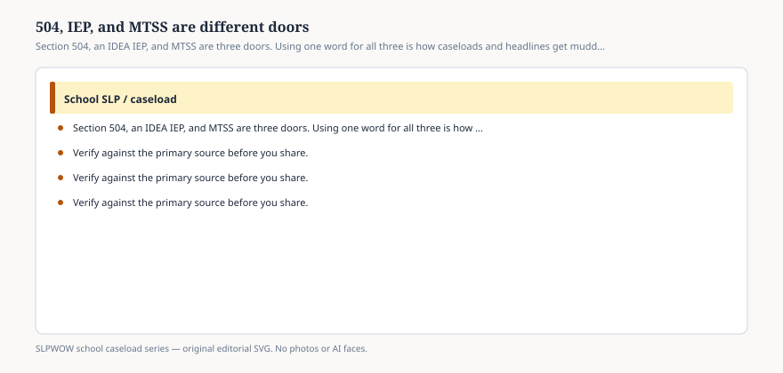

# Embed — 504-iep-and-mtss-are-different-doors

```html
<figure class="slpwow-figure slpwow-figure--infographic" itemscope itemtype="https://schema.org/ImageObject">
  
  <figcaption itemprop="caption">
    <strong>Figure 1.</strong> Section 504, an IDEA IEP, and MTSS are three doors. Using one word for all three is how caseloads and headlines get muddy.
    <span class="figure-credit">SLPWOW school caseload series — original SVG. Not legal, billing, union, or clinical advice.</span>
  </figcaption>
</figure>
```
