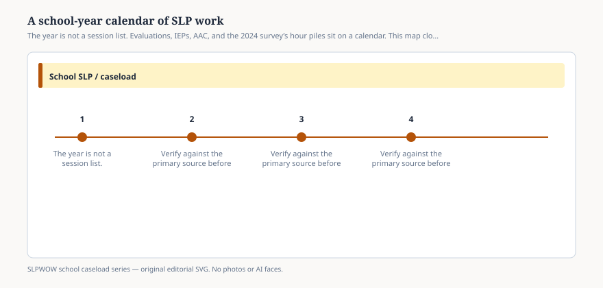

# Embed — a-school-year-calendar-of-slp-work

```html
<figure class="slpwow-figure slpwow-figure--infographic" itemscope itemtype="https://schema.org/ImageObject">
  
  <figcaption itemprop="caption">
    <strong>Figure 1.</strong> The year is not a session list. Evaluations, IEPs, AAC, and the 2024 survey’s hour piles sit on a calendar. This map closes the series.
    <span class="figure-credit">SLPWOW school caseload series — original SVG. Not legal, billing, union, or clinical advice.</span>
  </figcaption>
</figure>
```
