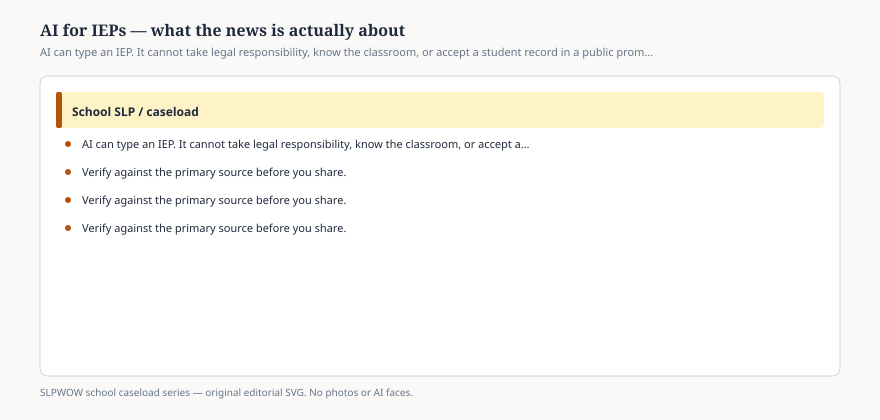

# Embed — ai-for-ieps-what-the-news-is-about

```html
<figure class="slpwow-figure slpwow-figure--infographic" itemscope itemtype="https://schema.org/ImageObject">
  
  <figcaption itemprop="caption">
    <strong>Figure 1.</strong> AI can type an IEP. It cannot take legal responsibility, know the classroom, or accept a student record in a public prompt. Read the tool as a tool.
    <span class="figure-credit">SLPWOW school caseload series — original SVG. Not legal, billing, union, or clinical advice.</span>
  </figcaption>
</figure>
```
