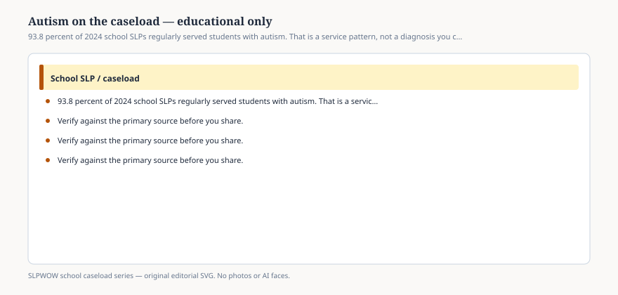

# Embed — autism-on-the-caseload-educational

```html
<figure class="slpwow-figure slpwow-figure--infographic" itemscope itemtype="https://schema.org/ImageObject">
  
  <figcaption itemprop="caption">
    <strong>Figure 1.</strong> 93.8 percent of 2024 school SLPs regularly served students with autism. That is a service pattern, not a diagnosis you can make from a blog.
    <span class="figure-credit">SLPWOW school caseload series — original SVG. Not legal, billing, union, or clinical advice.</span>
  </figcaption>
</figure>
```
