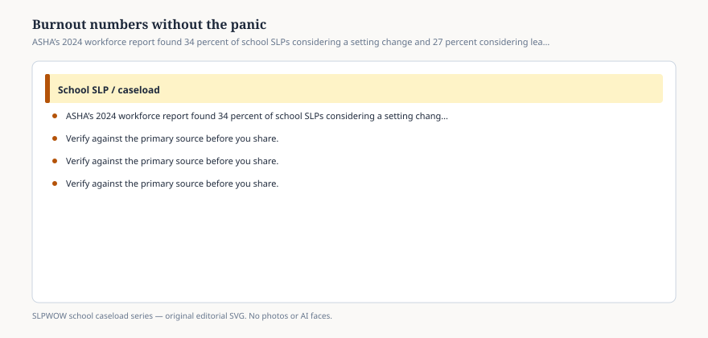

# Embed — burnout-numbers-without-the-panic

```html
<figure class="slpwow-figure slpwow-figure--infographic" itemscope itemtype="https://schema.org/ImageObject">
  
  <figcaption itemprop="caption">
    <strong>Figure 1.</strong> ASHA’s 2024 workforce report found 34 percent of school SLPs considering a setting change and 27 percent considering leaving. Read the items, not the panic.
    <span class="figure-credit">SLPWOW school caseload series — original SVG. Not legal, billing, union, or clinical advice.</span>
  </figcaption>
</figure>
```
