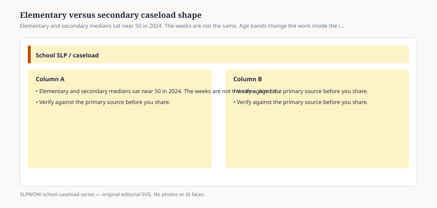

# Embed — elementary-versus-secondary-caseload-shape

```html
<figure class="slpwow-figure slpwow-figure--infographic" itemscope itemtype="https://schema.org/ImageObject">
  
  <figcaption itemprop="caption">
    <strong>Figure 1.</strong> Elementary and secondary medians sat near 50 in 2024. The weeks are not the same. Age bands change the work inside the integer.
    <span class="figure-credit">SLPWOW school caseload series — original SVG. Not legal, billing, union, or clinical advice.</span>
  </figcaption>
</figure>
```
