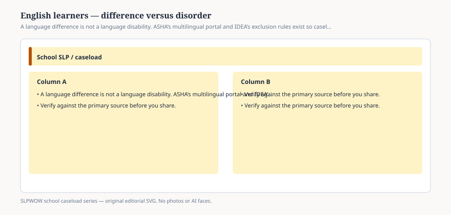

# Embed — english-learners-difference-versus-disorder

```html
<figure class="slpwow-figure slpwow-figure--infographic" itemscope itemtype="https://schema.org/ImageObject">
  
  <figcaption itemprop="caption">
    <strong>Figure 1.</strong> A language difference is not a language disability. ASHA’s multilingual portal and IDEA’s exclusion rules exist so caseloads do not become English class.
    <span class="figure-credit">SLPWOW school caseload series — original SVG. Not legal, billing, union, or clinical advice.</span>
  </figcaption>
</figure>
```
