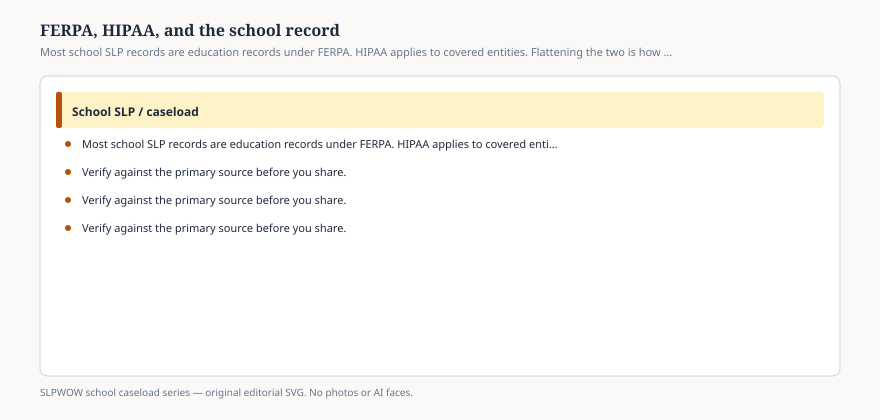

# Embed — ferpa-hipaa-and-the-school-record

```html
<figure class="slpwow-figure slpwow-figure--infographic" itemscope itemtype="https://schema.org/ImageObject">
  
  <figcaption itemprop="caption">
    <strong>Figure 1.</strong> Most school SLP records are education records under FERPA. HIPAA applies to covered entities. Flattening the two is how news stories and vendors get sloppy.
    <span class="figure-credit">SLPWOW school caseload series — original SVG. Not legal, billing, union, or clinical advice.</span>
  </figcaption>
</figure>
```
