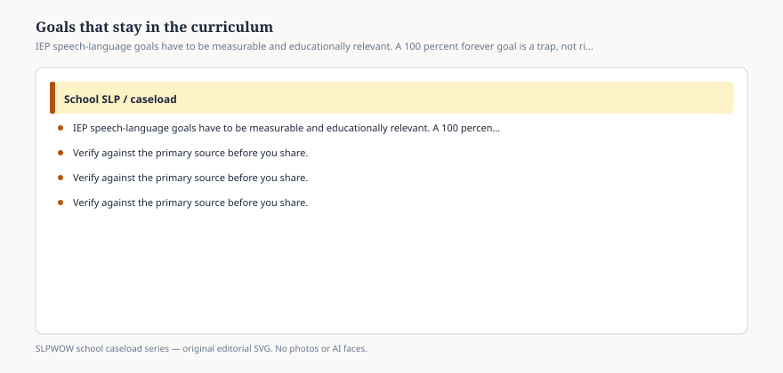

# Embed — goals-that-stay-in-the-curriculum

```html
<figure class="slpwow-figure slpwow-figure--infographic" itemscope itemtype="https://schema.org/ImageObject">
  
  <figcaption itemprop="caption">
    <strong>Figure 1.</strong> IEP speech-language goals have to be measurable and educationally relevant. A 100 percent forever goal is a trap, not rigor.
    <span class="figure-credit">SLPWOW school caseload series — original SVG. Not legal, billing, union, or clinical advice.</span>
  </figcaption>
</figure>
```
