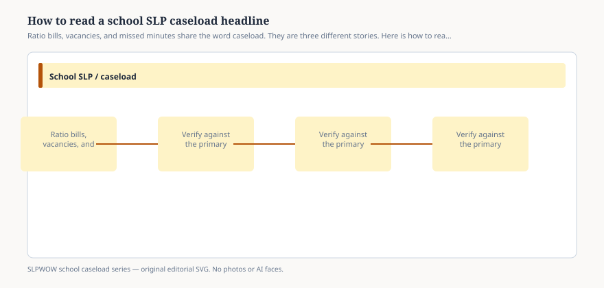

# Embed — how-to-read-a-school-slp-caseload-headline

```html
<figure class="slpwow-figure slpwow-figure--infographic" itemscope itemtype="https://schema.org/ImageObject">
  
  <figcaption itemprop="caption">
    <strong>Figure 1.</strong> Ratio bills, vacancies, and missed minutes share the word caseload. They are three different stories. Here is how to read the headline.
    <span class="figure-credit">SLPWOW school caseload series — original SVG. Not legal, billing, union, or clinical advice.</span>
  </figcaption>
</figure>
```
