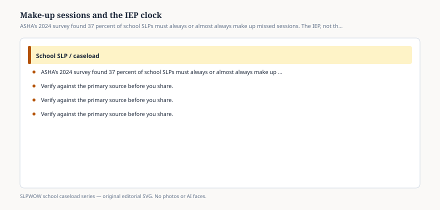

# Embed — makeup-sessions-and-the-iep-clock

```html
<figure class="slpwow-figure slpwow-figure--infographic" itemscope itemtype="https://schema.org/ImageObject">
  
  <figcaption itemprop="caption">
    <strong>Figure 1.</strong> ASHA’s 2024 survey found 37 percent of school SLPs must always or almost always make up missed sessions. The IEP, not the hallway, owns the minutes.
    <span class="figure-credit">SLPWOW school caseload series — original SVG. Not legal, billing, union, or clinical advice.</span>
  </figcaption>
</figure>
```
