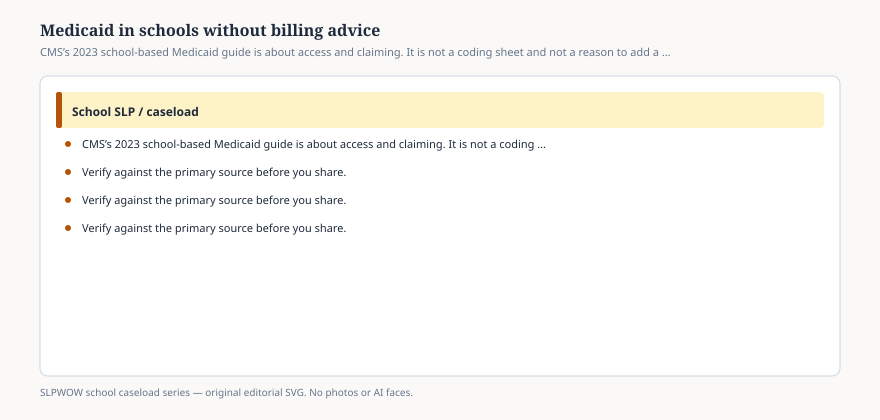

# Embed — medicaid-in-schools-without-billing-advice

```html
<figure class="slpwow-figure slpwow-figure--infographic" itemscope itemtype="https://schema.org/ImageObject">
  
  <figcaption itemprop="caption">
    <strong>Figure 1.</strong> CMS’s 2023 school-based Medicaid guide is about access and claiming. It is not a coding sheet and not a reason to add a second set of IEP goals.
    <span class="figure-credit">SLPWOW school caseload series — original SVG. Not legal, billing, union, or clinical advice.</span>
  </figcaption>
</figure>
```
