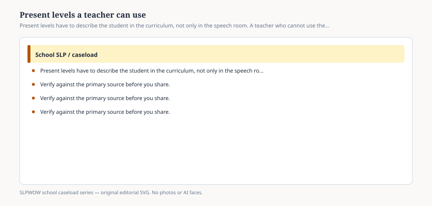

# Embed — present-levels-a-teacher-can-use

```html
<figure class="slpwow-figure slpwow-figure--infographic" itemscope itemtype="https://schema.org/ImageObject">
  
  <figcaption itemprop="caption">
    <strong>Figure 1.</strong> Present levels have to describe the student in the curriculum, not only in the speech room. A teacher who cannot use the paragraph cannot implement the IEP.
    <span class="figure-credit">SLPWOW school caseload series — original SVG. Not legal, billing, union, or clinical advice.</span>
  </figcaption>
</figure>
```
