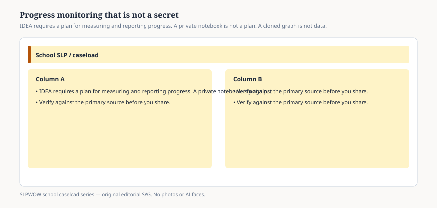

# Embed — progress-monitoring-that-is-not-a-secret

```html
<figure class="slpwow-figure slpwow-figure--infographic" itemscope itemtype="https://schema.org/ImageObject">
  
  <figcaption itemprop="caption">
    <strong>Figure 1.</strong> IDEA requires a plan for measuring and reporting progress. A private notebook is not a plan. A cloned graph is not data.
    <span class="figure-credit">SLPWOW school caseload series — original SVG. Not legal, billing, union, or clinical advice.</span>
  </figcaption>
</figure>
```
