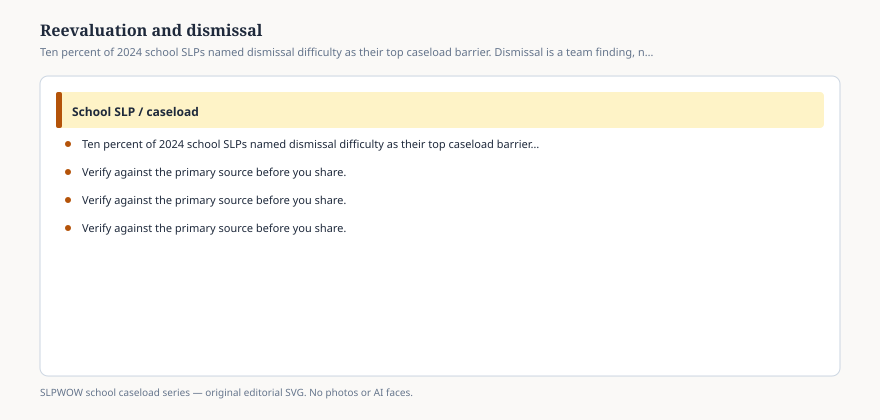

# Embed — reevaluation-and-dismissal

```html
<figure class="slpwow-figure slpwow-figure--infographic" itemscope itemtype="https://schema.org/ImageObject">
  
  <figcaption itemprop="caption">
    <strong>Figure 1.</strong> Ten percent of 2024 school SLPs named dismissal difficulty as their top caseload barrier. Dismissal is a team finding, not a mood.
    <span class="figure-credit">SLPWOW school caseload series — original SVG. Not legal, billing, union, or clinical advice.</span>
  </figcaption>
</figure>
```
