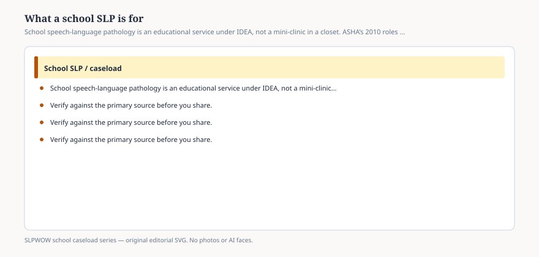

# Embed — what-a-school-slp-is-for

```html
<figure class="slpwow-figure slpwow-figure--infographic" itemscope itemtype="https://schema.org/ImageObject">
  
  <figcaption itemprop="caption">
    <strong>Figure 1.</strong> School speech-language pathology is an educational service under IDEA, not a mini-clinic in a closet. ASHA’s 2010 roles document still draws the line.
    <span class="figure-credit">SLPWOW school caseload series — original SVG. Not legal, billing, union, or clinical advice.</span>
  </figcaption>
</figure>
```
