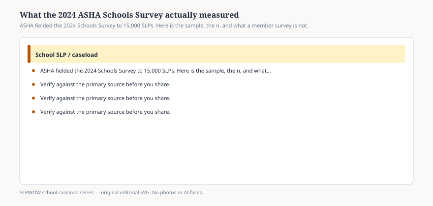

# Embed — what-the-2024-asha-schools-survey-measured

```html
<figure class="slpwow-figure slpwow-figure--infographic" itemscope itemtype="https://schema.org/ImageObject">
  
  <figcaption itemprop="caption">
    <strong>Figure 1.</strong> ASHA fielded the 2024 Schools Survey to 15,000 SLPs. Here is the sample, the n, and what a member survey is not.
    <span class="figure-credit">SLPWOW school caseload series — original SVG. Not legal, billing, union, or clinical advice.</span>
  </figcaption>
</figure>
```
