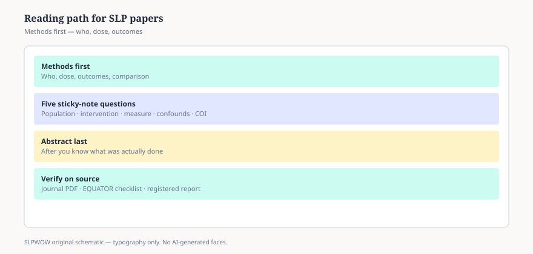

**Disclaimer.** Educational news briefing for SLPWOW. Not billing advice, not legal advice, not a treatment protocol, and not medical advice. Rules change by contractor, state, and calendar year. Verify the current CMS, MAC, state, or ASHA page before you act. This series does not evaluate patients and does not publish worksheets.

The PDF lands in your inbox at 6:41 a.m. with a subject line that already wants something from you. *New evidence that changes dysphagia care.* You have eleven minutes before the first student. The abstract is three sentences and a p-value. That is not a reading. That is a sales letter the journal allowed.

This piece is about the rest of the file.

## Start in the middle

Turn to Methods before you let the title set your mood. Who was in the room. How many. What they actually did, and for how long. What “improved” meant in a number you could write on a napkin. If those sentences are vague, the Discussion will not rescue them. It will decorate them.

CONSORT exists because trial reports used to hide the exits. PRISMA exists because reviews used to hide the search. You do not have to love reporting guidelines. You do have to notice when a paper that calls itself a trial cannot tell you how people were assigned, or a review that calls itself systematic cannot tell you what it searched. The EQUATOR Network keeps the checklists in public. They are not a religion. They are a flashlight.

ASHA’s journals spent 2022 saying out loud that they wanted more of that flashlight — data statements, badges, registered reports at *JSLHR*. That is news about the house the papers live in. It is not a halo over any one article. A paper can wear an open-science badge and still ask a small question badly.

## Five questions that fit on a sticky note

**Who is this about.** Age, diagnosis labels, setting, language, how they got into the study. A school caseload in rural Arkansas is not a university clinic in a coastal city. A paper that recruited “adults with dysphagia” and then studied twenty people after hemispherectomy has told you something. It has not told you about the person in the recliner on 3-south.

**What was done to them.** Dose, duration, who delivered it, whether the comparison was another treatment or “usual care” that nobody defined. If you cannot retell the procedure in two sentences without inventing steps, you do not have a procedure. You have a vibe. This series will not turn that vibe into a Monday protocol. That is the point.

**What was measured.** A standardized score, a rating scale, a yes/no from a parent, a pixel on a swallow study. Outcomes that match the claim belong in the same paragraph as the claim. “Quality of life improved” with no instrument is a mood. “Penetration-aspiration scores moved” without saying how many swallows were scored is a rumor.

**What else could have done that.** Practice effects. A second clinician who smiled more. Time. The fact that people who stay in a study are not a random draw of the people who started it. You do not need a statistics course to ask the question. You need the stubbornness to ask it before you forward the PDF.

**What the authors were paid to hope.** Conflicts are a later essay (09). Read the line anyway. A thickener company in the funding sentence does not make the data false. It makes the abstract a place you walk more slowly.

## The p-value is not the plot

The American Statistical Association’s 2016 statement is still the cleanest public document for this: a p-value does not measure the size of an effect, and it does not measure whether a result matters in a booth. Essay 03 stays there. For this page, one habit is enough. If the authors give you only a star and a narrative, they have not given you a finding you can carry down the hall. Ask for the actual difference, the interval, the overlap. If they will not print it, that is also information.

Single-subject designs — the other half of our literature — have their own honesty problems and their own virtues. Essay 04. Do not grade a multiple-baseline paper as if it failed to be a 400-person RCT. Do not grade a 400-person RCT as if it told you what to do with the one child who did not look like the mean.

## What “changes practice” would actually look like

A paper changes practice when a guideline group, a payer, or a department can point to it and change a rule. That is rare. Most papers change a conversation. That is still worth your eleven minutes, if you spend them on the methods.

What does not change practice: a thread that quotes the abstract, a vendor webinar that quotes the thread, a staff meeting that quotes the webinar. By the time the claim reaches the copy machine it has shed its sample size.

You are allowed to say, in a note to yourself, “interesting, not enough.” You are allowed to wait for the registered report, the replication, the review that used PRISMA on purpose. Waiting is not anti-science. Forwarding the abstract as if it were a protocol is.

## A way to use this series

The next nine pieces stay in the mailbox: abstracts, p-values, single-subject, reviews that are just lists, predatory invitations, preprints, guidelines vs threads, conflict lines, open science at ASHA. Then the pack leaves the journal and walks into CMS.

If a colleague wants a treatment recipe from a news URL, this series will disappoint them. If they want a way to keep their integrity when the PDF is flattering, that is the job.

Print the methods. Write the five questions in the margin. Leave the abstract for last, the way some people leave the frosting. You will like it better when you know what it is sitting on.

<figure class="slpwow-figure slpwow-figure--infographic" itemscope itemtype="https://schema.org/ImageObject">
  
  <figcaption itemprop="caption">
    <strong>Figure 1.</strong> Reading path for an SLP paper (schematic). Start in Methods, ask five verification questions, read the abstract last, then verify on the journal PDF.
    SLPWOW SLP News — practice pack — original editorial SVG. Not billing, legal, or clinical advice.
  </figcaption>
</figure>
