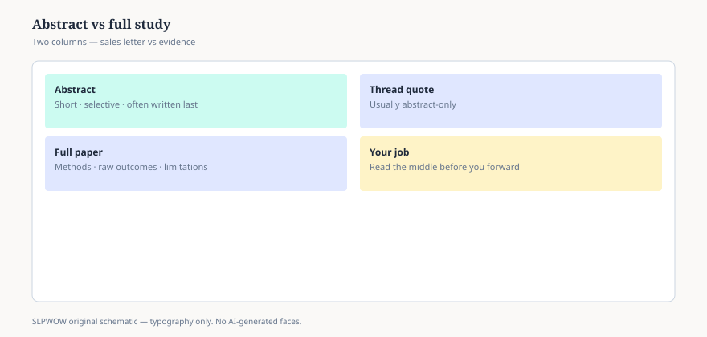

**Disclaimer.** Educational news briefing for SLPWOW. Not billing advice, not legal advice, not a treatment protocol, and not medical advice. Rules change by contractor, state, and calendar year. Verify the current CMS, MAC, state, or ASHA page before you act. This series does not evaluate patients and does not publish worksheets.

An abstract has a job, and the job is not your continuing education. The job is to get a tired person to click, a database to index, and a journalist to write a headline that will be wrong by lunch. None of those people are sitting in your booth.

This is not a rant against abstracts. It is a reminder of what they are.

## What the first paragraph is allowed to hide

Structured abstracts — Background, Method, Results, Conclusions — are better than a lyric paragraph. They are still a compression. Compression drops the awkward bits: the people who left, the outcome that did not move, the secondary analysis that became the title.

CONSORT asks trial abstracts to carry design, participants, interventions, and the primary outcome. Plenty of communication-science papers are not trials and do not owe CONSORT a full bow. Plenty of trial abstracts still bury the primary outcome under a secondary one that photographed better. If the methods say the primary endpoint was a standardized language score at twelve weeks, and the abstract leads with a parent satisfaction item at week three, you are not reading a summary. You are reading a preference.

Reviews do the same dance. PRISMA wants the abstract to say how many studies made it in, and something about the certainty of the evidence. An abstract that says “treatment X is effective” after a search that found four tiny papers with no common outcome has performed a magic trick. The hat is empty. The rabbit is branding.

## Spin has a smell

You do not need a media-studies degree. You need a nose.

**Absolutes in a sample of twenty.** “Demonstrates that,” “proves,” “should be adopted.” A paper can be honest and still use those verbs. A paper that uses them in the abstract and then, in the limitations, admits it had no control group is not confused. It is performing.

**Missing comparators.** “Improved after therapy” is not news. People often improve after time, after attention, after a second adult in the room. The abstract that never names the comparison has not told you whether the treatment did anything extra.

**P-values without sizes.** Essay 03. If all you get is “significant,” you have been handed a doorbell, not a house.

**Populations that vanish.** “Children with speech sound disorders” in the title; “monolingual English-speaking four-year-olds without hearing loss in a university clinic” in the methods. Both sentences can be true. Only one belongs in your head when you walk into a classroom.

**Industry syntax.** “Innovative,” “breakthrough,” “real-world evidence” used as a compliment rather than a design. Real-world evidence is a kind of study. It is not a gold sticker.

## How a clinician actually uses an abstract

Use it as a filter, not as a finding.

Read it to decide whether the full text is worth a Saturday. Look for the n, the setting, the outcome, the design word (trial, cohort, single-subject, qualitative, review). If those words are missing, the paper may still be good. The abstract is already telling you it will make you work.

Then — this is the part people skip — open the paper to the table that shows the actual numbers. If you cannot find the table, and the journal is paywalled, you are allowed to stop. You are not required to let a three-sentence teaser become the voice in the next IEP meeting.

ASHA journals have been pushing transparency badges and data statements. That helps the person who *does* open the file. It does not make the abstract longer. The abstract remains a postcard.

## What not to do with a postcard

Do not paste it into a progress note as if it were a rationale. “Per Smith 2024, treatment X is effective” is a citation of a postcard. If you need a rationale, you need the methods and the outcome that match the person in front of you — and you need your license, not this URL.

Do not send the abstract to a family as homework. Families deserve public pages (ASHA’s consumer site, NIDCD, CDC) written for them. An abstract written to impress a reviewer is a cruel gift.

Do not let a vendor’s email quote the abstract at you as if the vendor had read the limitations. They are not required to. You are, if you are going to change a habit.

## A small ritual that takes four minutes

1. Highlight every causal verb in the abstract.
2. Open Methods. Write one sentence: who, what, how long.
3. Open the first results table. Write the actual difference, or write “not printed.”
4. Only then decide whether the causal verbs earned their keep.

If step 3 says “not printed,” you do not have a quarrel with statistics. You have a quarrel with the authors’ manners.

Essay 01 was the map. This page is the first trap on the map. The next pages are the other traps: stars that are not sizes, single-subject papers graded with the wrong ruler, reviews that are shopping lists, journals that want your credit card more than your methods, preprints that have not met a reviewer, guidelines that get flattened into threads.

The abstract will still be there at 6:41 a.m. You can let it wait until you have seen the table. The student in the waiting room will not mind. The PDF might.

<figure class="slpwow-figure slpwow-figure--infographic" itemscope itemtype="https://schema.org/ImageObject">
  
  <figcaption itemprop="caption">
    <strong>Figure 1.</strong> Abstract versus full study (schematic). The abstract is a summary; methods and outcomes live in the body.
    SLPWOW SLP News — practice pack — original editorial SVG. Not billing, legal, or clinical advice.
  </figcaption>
</figure>
