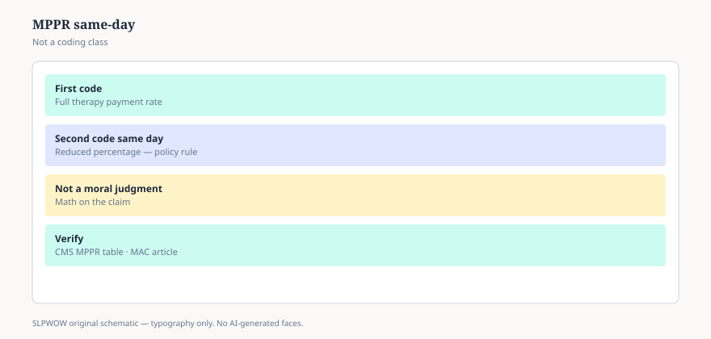

**Disclaimer.** Educational news briefing for SLPWOW. Not billing advice, not legal advice, not a treatment protocol, and not medical advice. Rules change by contractor, state, and calendar year. Verify the current CMS, MAC, state, or ASHA page before you act. This series does not evaluate patients and does not publish worksheets.

MPPR is an ugly acronym for a simple idea. If more than one “always therapy” service happens to the same person on the same day, Medicare does not want to pay the full practice-expense story more than once. Since April 1, 2013, the haircut has been 50 percent of the practice-expense RVU on the second and later codes. The code with the highest practice-expense value keeps 100 percent of that piece. The others keep half of theirs. Work and malpractice are not the part being halved.

CMS still posts an MPPR rate file on the Therapy Services page. The 2026 file was updated in February 2026. The policy did not sunset. That is the news: it is still there, and it still crosses disciplines.

## The part people miss

The reduction is per day, per patient, across PT, OT, and SLP in the same facility or practice arrangement CMS is looking at. A swallow evaluation in the morning and a PT gait session in the afternoon can be one day in the arithmetic. ASHA’s 2026 analysis said that out loud. It also said something kind: many SLP codes are untimed, service-based, and often the higher-valued object on the ticket, so they are *less* often the ones getting the haircut. “Less often” is not “never.”

This is why a department that schedules “stacked therapy” as a convenience for families can look efficient on a whiteboard and thinner on a remittance. The whiteboard is not wrong. It is incomplete.

## What MPPR is not

It is not a judgment that the second service was unnecessary. It is a pricing rule. Necessity lives in the record (essay 32). MPPR lives in the math.

It is not the 8-minute rule (essay 18). One is about units of timed codes. The other is about overlapping practice expense on a date of service.

It is not NCCI (essay 17). NCCI is about whether two codes may be billed together at all. MPPR assumes they were allowed, then pays the second one less.

It is not a reason to skip a needed eval. Changing a clinical plan to dodge a practice-expense haircut is a different conversation, and not one this URL will have.

## Why ASHA keeps a heading on it

Because every year someone asks if “this is the year they end it.” 2026 was not that year. The fee-schedule analysis kept the policy and pointed members to ASHA’s own MPPR scenarios. Those scenarios are member tools. They are not reprinted here. Reprinting them would be a worksheet dump, and the house rule is no worksheet dumps.

If you need a scenario, get it from ASHA or from your MAC on the day you need it. If you only need to understand a remittance that looks like a cut, start here: look at the date, look at the other therapy lines, look at whether PE was the piece that moved.

## A hallway version

“Same patient, same day, more than one therapy service — Medicare halves the practice-expense part of the extras. That’s MPPR. It’s old. It’s still on.” If someone wants to know which of *their* codes sits on the list, they can open the CMS ZIP. If someone wants to know how to re-sequence a day to maximize payment, they have left news and entered a consulting product. This series does not sell that product.

Essay 15 is the modifier people still confuse with a cap. MPPR can apply whether or not you ever see a KX. They stack. They are still not a cliff.

<figure class="slpwow-figure slpwow-figure--infographic" itemscope itemtype="https://schema.org/ImageObject">
  
  <figcaption itemprop="caption">
    <strong>Figure 1.</strong> MPPR same-day math (schematic). Second code reduced per policy — verify CMS table, not a worksheet.
    SLPWOW SLP News — practice pack — original editorial SVG. Not billing, legal, or clinical advice.
  </figcaption>
</figure>
