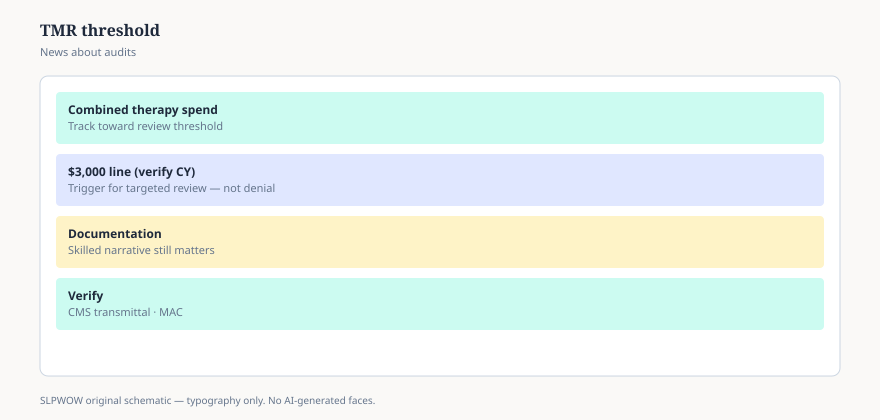

**Disclaimer.** Educational news briefing for SLPWOW. Not billing advice, not legal advice, not a treatment protocol, and not medical advice. Rules change by contractor, state, and calendar year. Verify the current CMS, MAC, state, or ASHA page before you act. This series does not evaluate patients and does not publish worksheets.

There is a dollar that means “someone *may* look.” It is not the KX dollar. It is not a discharge date. CMS calls it the medical record (MR) threshold. In hallway English it is still “the $3,000 review.”

The Bipartisan Budget Act of 2018 kept a targeted medical review process that MACRA had started, and set the trigger at $3,000 — one amount for PT and SLP combined, one for OT. CMS’s 2026 claims-processing language says that amount stays $3,000 until calendar year 2028, when it starts moving with the Medicare Economic Index. ASHA’s 2026 PDF uses the same $3,000 and the same “combined with PT” idea.

Targeted is the word. Not every chart over the line is pulled. Not every pulled chart is over the line. Review can find you for other reasons: a modifier, a pattern, a complaint, bad luck.

## What “targeted” was supposed to fix

The old world after a cap exception was a rumor mill: everyone over a number gets a letter. Targeted review was sold as a smaller net — contractors looking where the data look odd, not where a birthday landed. Whether your MAC feels small or large is a local weather report. The public rule is still: a threshold exists, and it is not automatic doom.

If your office treats $3,000 as a second cap, you will discharge people who still have a skilled need, and you will not have a statute to point to. If your office treats $3,000 as imaginary, you will be surprised by a request for records. Both failures are avoidable with one sentence: this is a review trigger, not a benefit limit.

## How it sits next to KX

Order of operations in a tired brain:

1. Hard cap — gone (essay 11).
2. KX threshold — $2,480 in 2026, attestation on the claim (essay 15).
3. MR threshold — $3,000, a chance of chart review, not a modifier of its own.

A person can cross (2) in October and (3) in November and never hear from a contractor. A person can hear from a contractor in March for a reason that has nothing to do with either number. Software that paints the two dollars the same color is not on your side.

## What a review is asking, in English

Is there a plan. Is there a skilled reason this visit existed. Did the goals move, or is there a Jimmo-shaped maintenance story that is still skilled. Are the minutes in the note in the same universe as the claim. This is not a protocol for writing the note. It is a list of why “patient tolerated treatment well” became a meme.

ASHA points members to pages on manual medical review. Those pages change. This pack will not mirror them. If a request arrives, your compliance people and the contractor’s instructions win. A news brief does not.

## A family sentence

“There’s a dollar where Medicare might ask to see the chart. It isn’t a cutoff. If we get a letter, we’ll handle the paperwork. You don’t have to stop coming because a number exists.” Then, privately, you make sure the chart can take the letter.

If you want a political opinion about whether $3,000 is the right number, write your member of Congress. If you want the current number, write CMS’s Therapy Services URL on a sticky note and look at it once a year. In 2026 the sticky note still says three thousand, and still does not say cap.

Contractors also review for reasons that never touch this line: a modifier pattern, a same-day pair that NCCI hates (essay 17), a complaint, a probe of a provider type. Teaching staff that “we’re safe under $3,000” is how thin notes survive until a different letter arrives. The dollar is a spotlight. It is not a bunker.

<figure class="slpwow-figure slpwow-figure--infographic" itemscope itemtype="https://schema.org/ImageObject">
  
  <figcaption itemprop="caption">
    <strong>Figure 1.</strong> Targeted medical review threshold (schematic). Dollar line triggers review — verify current CMS transmittal.
    SLPWOW SLP News — practice pack — original editorial SVG. Not billing, legal, or clinical advice.
  </figcaption>
</figure>
