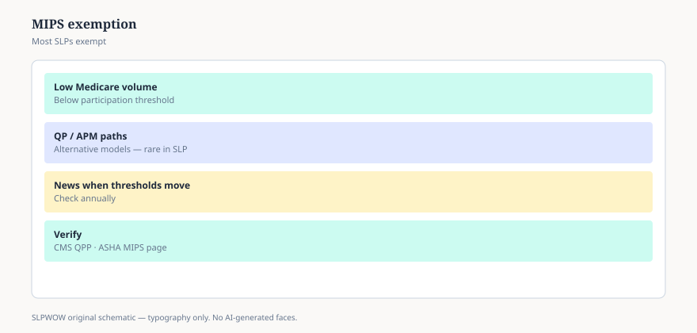

**Disclaimer.** Educational news briefing for SLPWOW. Not billing advice, not legal advice, not a treatment protocol, and not medical advice. Rules change by contractor, state, and calendar year. Verify the current CMS, MAC, state, or ASHA page before you act. This series does not evaluate patients and does not publish worksheets.

Once a year a slide deck arrives in a hospital inbox: *Quality Payment Program. MIPS. You must report or you will be cut.* The slide deck was built for a physician group. Then it gets forwarded to speech as if the “you” were universal.

ASHA’s 2026 Medicare fee-schedule analysis said the quieter fact: most speech-language pathologists remain exempt from MIPS reporting. They also have limited ways into Advanced APMs (essay 13). The Quality Payment Program is a building with two main doors. A lot of us do not have a key to either, and that is not a moral failing. It is how the statute and the low-volume thresholds were built.

## What MIPS is, in a paragraph

A score built from quality measures, improvement activities, promoting interoperability, and cost — the mix has moved over the years — that can nudge a Part B payment up or down two years later. It is a CMS program with a website (qpp.cms.gov), eligibility lookups, and a special kind of anxiety. Eligibility is not “I treat Medicare patients.” It is a set of volume and allowed-charge thresholds, plus whether you are a clinician type the program is looking at in that year.

If you are below the threshold, you are not “avoiding quality.” You are in the low-volume bucket the program itself carved out. If you are employed by a group that *is* reporting, your name may get swept into a group story. That sweep is an employment fact. It is not a personal invitation to invent measures at midnight.

## Why the slide deck still shows up

Health systems like one language. Vendors sell one dashboard. A director who just sat through a physician meeting has a hammer and is looking for nails. Speech measures exist. Some of them are even about us. Reporting them as a voluntary act, or as part of a group’s story, can be a reasonable local choice. “Must,” for an exempt clinician, is usually a must from the employer, not from CMS.

Ask: am I individually eligible this year. The QPP lookup is public. ASHA has member pages that walk the lookup. This pack will not walk it, because the thresholds move and a frozen walkthrough becomes a lie.

## What exemption is not

It is not a holiday from medical necessity, documentation, or state license rules. It is not a holiday from Joint Commission if you live in that house. It is not a reason to sneer at colleagues who *are* reporting. It is not an Advanced APM. People stack the acronyms because they all arrived in the same decade.

It is not “quality doesn’t apply to speech.” Families still get to judge us. Students still get to progress or not. Exemption is a payment-program sentence.

## The APM door, again

Qualifying APM participants get the larger conversion factor (essay 13). Most SLPs, ASHA said, are not QPs and have few on-ramps. If your system is in a model, ask whether therapy is in the risk story and whether *you* are a QP. Those answers come from finance and CMS, not from a news brief.

## A hallway version

“MIPS is a real program. I’m going to check whether I’m even eligible before I build a second job out of it. ASHA’s last public read is that most of us aren’t.” If the slide deck author looks crushed, they can keep the deck for the people it was written for.

That closes the outpatient-dollar wave. The next pieces walk into buildings that do not live on the Physician Fee Schedule: school Medicaid, IDEA, two clocks, a swallow study that arrives in a backpack. The dollars change religion. The need for English does not.

<figure class="slpwow-figure slpwow-figure--infographic" itemscope itemtype="https://schema.org/ImageObject">
  
  <figcaption itemprop="caption">
    <strong>Figure 1.</strong> MIPS exemption (schematic). Most SLPs remain below participation thresholds — verify CMS QPP.
    SLPWOW SLP News — practice pack — original editorial SVG. Not billing, legal, or clinical advice.
  </figcaption>
</figure>
