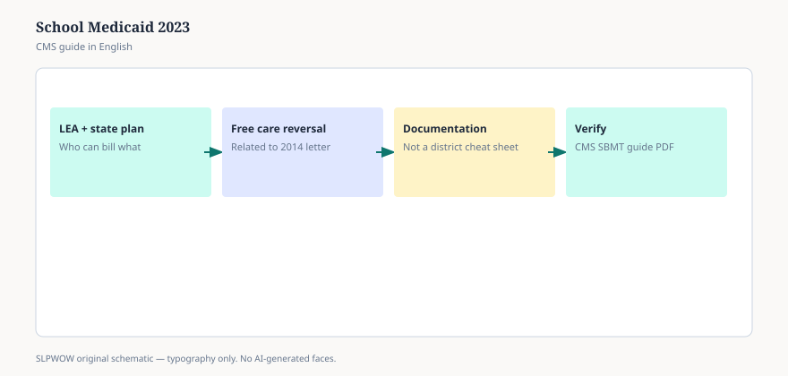

**Disclaimer.** Educational news briefing for SLPWOW. Not billing advice, not legal advice, not a treatment protocol, and not medical advice. Rules change by contractor, state, and calendar year. Verify the current CMS, MAC, state, or ASHA page before you act. This series does not evaluate patients and does not publish worksheets.

In May 2023, CMS — with the Department of Education in the room — published a long guide with a long name: *Delivering Services in School-Based Settings: A Comprehensive Guide to Medicaid Services and Administrative Claiming.* A CMCS bulletin the same week told states to read it. The Bipartisan Safer Communities Act had told them to write it. The 1997 and 2003 school-claiming guides were, in CMS’s own words, superseded.

That is the news: there is a current federal book, it is public, and it is trying to make school-based claiming less of a folk practice.

## What the book is trying to do

CMS wants states and districts to use schools as a place Medicaid-enrolled students actually get covered care, including the EPSDT idea that children get what they need to find and fix problems. The bulletin said primary, preventive, and mental-health use had not returned to pre-pandemic levels. Speech is in the book as part of the PT/OT/speech-hearing-language benefit, tied to 42 C.F.R. §440.110 — diagnostic, screening, preventive, or corrective services provided by or under the direction of a qualified speech pathologist, with a referral from a physician or other licensed practitioner as state law allows.

Notice the verbs. *Covered. Qualified. Referred. State plan.* Those verbs are why a district cannot read the PDF and start billing tomorrow. The federal book is an invitation and a set of flexibilities (how you document, how you time-study, how you pay). The state plan is the door.

## Flexibilities, not a national claim form

The guide talks about roster billing, per-child-per-month ideas, cost reconciliation, random-moment time studies, worker logs. It tells states they *may* adopt burdens that are lighter than the 2003 religion. “May” is doing a lot of work. Your state Medicaid agency and your SEA have to want the lighter religion. Many still live in a 2008 SPA and a vendor spreadsheet.

MACPAC’s 2024 brief is a useful second public source: states have been uneven about expanding school services beyond IEP-only claiming, even after the 2014 free-care letter (essay 27). Twenty-five had moved by late 2023, in MACPAC’s count, some only for behavioral health. Speech may or may not be in your state’s expansion. The federal guide does not finish that sentence.

## What an SLP should take, and leave

Take: there is a current federal document you can quote when someone says “CMS doesn’t want schools to bill.” Take: speech is explicitly in the benefit conversation, not an afterthought. Take: documentation still has to show a qualified provider, a covered service, a Medicaid-enrolled student, and whatever your state added.

Leave: any sentence that starts “so we should always…” Leave the time-study math. Leave the SPA draft. Those are state jobs. This URL is not your LEA’s claiming vendor.

## The qualification sentence people skip

§440.110’s speech pathologist is a CCC, or the equivalent education and experience, or a person in the supervised experience for the CCC. State Medicaid can be stricter. State education licensure can be a third object. A district that lets a speech-language *assistant* do the work and then asks Medicaid to pretend it was the pathologist has left the federal definition. This page will not sort your supervision statute. It will say the federal definition exists and is not a vibe.

## A hallway version

“There’s a 2023 CMS/ED guide that replaced the old school-claiming books. It wants more care in schools and gives states optional simpler ways to claim. It does not write our SPA, and it does not write my session.” If the special-ed director wants the PDF, it is free. If they want you to become the biller, they want a different hire.

Essay 27 is the 2014 letter the 2023 guide keeps citing: free care is not the barrier people still describe in 2003 English.

<figure class="slpwow-figure slpwow-figure--infographic" itemscope itemtype="https://schema.org/ImageObject">
  
  <figcaption itemprop="caption">
    <strong>Figure 1.</strong> School-based Medicaid guide (schematic). LEA billing and documentation — verify CMS SBMT PDF.
    SLPWOW SLP News — practice pack — original editorial SVG. Not billing, legal, or clinical advice.
  </figcaption>
</figure>
