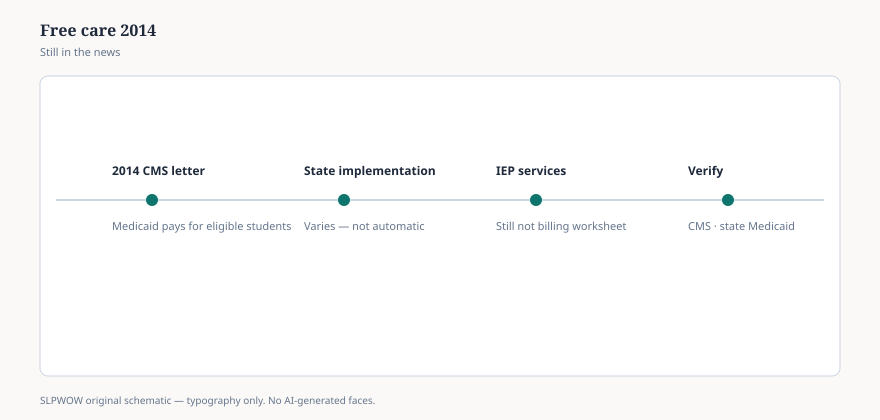

**Disclaimer.** Educational news briefing for SLPWOW. Not billing advice, not legal advice, not a treatment protocol, and not medical advice. Rules change by contractor, state, and calendar year. Verify the current CMS, MAC, state, or ASHA page before you act. This series does not evaluate patients and does not publish worksheets.

For a long time the folk rule in school health was: if you give it away to everyone, Medicaid will not pay for the enrolled kid. Nurses heard it. SLPs heard it. The 2003 claiming guide helped the folk rule sound official.

On December 15, 2014, CMS sent State Medicaid Director letter #14-006 and took the folk rule back. The Departmental Appeals Board had already said the old “free care” policy was not actually in the statute. CMS agreed, in public, that Medicaid can pay for a covered service to an enrolled beneficiary even when the same service is free to the student next to them.

The 2023 school-based guide repeats the letter as if some states have not finished reading it. MACPAC’s 2024 brief repeats the same timeline. A policy can be eleven years old and still be news if the hallway has not caught up.

## What the letter actually opened

Not a treasure chest. A permission structure. If the service is in the state plan (or owed under EPSDT), if the child is enrolled, if the provider is Medicaid-qualified, if the other federal and state rules are met — the fact that the district does not charge a cash price is not, by itself, a reason to refuse FFP.

CMS also said it would not treat the school as a legally liable third party just for doing its 504 job of giving students access to school. That sentence is why people talk about billing for services that are *not* on an IEP. The IEP is not the only door. In states that took the letter seriously, a Medicaid-enrolled student can receive a covered school-health service without a disability label. In states that did not change the plan, the letter is a PDF in a drawer.

MACPAC counted, as of October 2023, twenty-five states that had expanded beyond IEP/IFSP-only claiming, many of them toward behavioral health. Your state may be in the other half. “CMS said we can” is not “our SPA says we do.”

## What it did not do

It did not make every classroom support a medical service. It did not erase parental consent rules your state still has. It did not erase FERPA/HIPAA choreography. It did not make an SLP the biller. It did not decide that a five-minute hallway cue is a claim. Those are local and ethical questions. The letter removed *one* federal reason for no.

It did not make IDEA go away. Schools still owe FAPE. Medicaid is a possible payer, not a replacement for the education duty (essay 28, essay 34).

## Why SLPs still hear 2003 English

Vendors who sold IEP-only claiming software. Board attorneys who learned the old rule and never got the memo. A fear that billing Medicaid turns the SLP into a medical provider and the IEP into a hospital chart. That last fear is a category error with a feeling behind it. You can be a related-service provider *and* a person whose work sometimes meets a medical benefit definition. The Supreme Court has even said, in other words, that an IEP line is not automatically “only educational.” ASHA has been quoting that idea for years. Feelings still win meetings.

## A hallway version

“The old ‘if it’s free you can’t bill Medicaid’ rule was withdrawn in 2014. The 2023 guide repeats that. Whether *our* state plan bills beyond the IEP is a different sentence. I’m not going to run a claim from a news brief.” If the superintendent wants the letter, it is two pages of federal English. If they want a new SPA, they want the Medicaid agency, not the booth.

Essay 28 is the category error in the other direction: treating every IEP minute as if it were already medical necessity under Medicare’s religion. Two languages. Two clocks. One child.

<figure class="slpwow-figure slpwow-figure--infographic" itemscope itemtype="https://schema.org/ImageObject">
  
  <figcaption itemprop="caption">
    <strong>Figure 1.</strong> Free-care policy (schematic). 2014 letter still shapes who pays — verify state Medicaid guidance.
    SLPWOW SLP News — practice pack — original editorial SVG. Not billing, legal, or clinical advice.
  </figcaption>
</figure>
