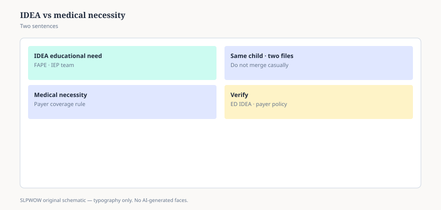

**Disclaimer.** Educational news briefing for SLPWOW. Not billing advice, not legal advice, not a treatment protocol, and not medical advice. Rules change by contractor, state, and calendar year. Verify the current CMS, MAC, state, or ASHA page before you act. This series does not evaluate patients and does not publish worksheets.

A child can need speech at school and not meet a health plan’s idea of medical necessity. A child can meet a health plan’s idea and not qualify as a child with a disability under IDEA. A child can meet both, in the same week, for reasons that look identical in a session and different on a form.

If that paragraph feels like a trick, you have been living in one language and visiting the other.

## IDEA’s question

Does this student have a disability as the Act defines it, and do they need special education and related services to receive a free appropriate public education. *Endrew F.* (2017) told schools the “appropriate” part is not a trivial benefit. ASHA’s workload page cites the case on purpose: the work has to be enough for progress that is ambitious in light of the child’s circumstances. That is an education-law sentence. It is about the IEP, the team, and the school day.

Related services — speech-language pathology among them — exist to help the child benefit from special education. The team’s “need” is educational access and progress, not a CPT code.

## A health plan’s question

Is this skilled care reasonable and necessary to diagnose or treat a condition, in the benefit, in the setting the plan covers. Medicare’s version of that sentence lives in the Benefit Policy Manual and in LCDs (essay 22). Medicaid’s version lives in the state plan and in EPSDT’s broader “correct or ameliorate” idea for children. Private plans invent their own adjectives and then pretend they are science.

A swallow study after a brainstem stroke is an easy medical-necessity story. A second-grader who cannot tell a sequenced story in a way that lets them access the curriculum is an easy IDEA story. The same second-grader may or may not have a plan that will pay for an after-school clinic. The clinic’s denial is not a comment on the IEP. The IEP’s existence is not a comment on the clinic’s denial.

## The mash that hurts families

School staff say “if they qualified at school, insurance has to pay.” Clinic staff say “if insurance denied, the school is exaggerating.” Both sentences treat one language as a translation of the other. They are not translations. They are neighboring dialects.

CMS’s 2023 school guide lives in the Medicaid dialect and keeps reminding states that a covered service to an enrolled child can happen at school. It does not say the IEP is a prescription. ED’s IDEA pages live in the education dialect and do not write your LCD.

## What *Endrew* changed, and did not

It raised the temperature of “some benefit.” It did not write a minute requirement. It did not create a national caseload number (essay 29). It did not turn every speech goal into a medical claim. People who cite *Endrew* as a billing tool are borrowing a Supreme Court opinion for a job it did not apply for.

## A hallway version

“IDEA need is about FAPE. Medical necessity is about a benefit manual. I can write both stories when both are true. I will not pretend one form fills the other.” If a parent wants a clinic after a school eval, they deserve an honest map of the two doors, not a promise. If a clinic wants school records, they deserve a consent path, not a rumor.

Essay 30 is the physical version of this split: the school bell and the hospital clock, and why a person who works both jobs feels insane by Thursday.

<figure class="slpwow-figure slpwow-figure--infographic" itemscope itemtype="https://schema.org/ImageObject">
  
  <figcaption itemprop="caption">
    <strong>Figure 1.</strong> IDEA need versus medical necessity (schematic). Educational FAPE language is not the payer's coverage test.
    SLPWOW SLP News — practice pack — original editorial SVG. Not billing, legal, or clinical advice.
  </figcaption>
</figure>
