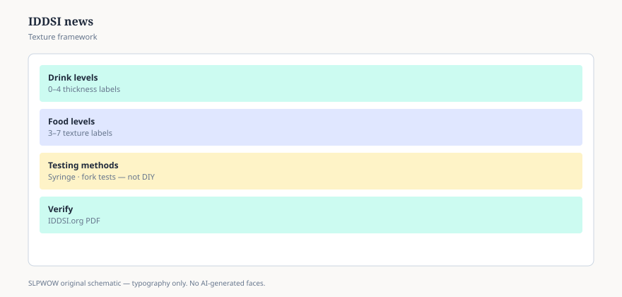

**Disclaimer.** Educational news briefing for SLPWOW. Not billing advice, not legal advice, not a treatment protocol, and not medical advice. Rules change by contractor, state, and calendar year. Verify the current CMS, MAC, state, or ASHA page before you act. This series does not evaluate patients and does not publish worksheets.

IDDSI is a labeling system. Eight levels, colors, numbers, names, so that “nectar” in one building is not “something else” in the next. Cichero and colleagues published the framework story in *Dysphagia* in 2017. The United States launch talk was 2019. The Academy of Nutrition and Dietetics later made IDDSI the texture language in its Nutrition Care Manual and retired the National Dysphagia Diet from that manual (ASHA notes October 2021). Those dates are the spine.

The 2026 headline is smaller and still worth a staff meeting: the current *framework and detailed definitions* on IDDSI’s public resources page are **version 2.2**. The current *testing methods* are still posted as **2.0**. A change log that circulated with the 2.2 definitions removed some “pre-gelled / soaked bread” example language and sandwich images from Levels 5 and 6. That is a definitions cleanup, not a new religion. If your kitchen laminated 2019 examples that showed a soaked sandwich as if it were a default Level 5 citizen, the laminate is the news, not your clinical judgment.

## What did not change

ASHA still supports the framework. A 2022 Board resolution (BOD 16-2022) kept that support, including convention presence. ASHA also still says, on the diet-modifications page, that **neither ASHA nor any U.S. payer mandates adoption**. Support and mandate are different verbs. Threads mash them (essay 08).

ASHA still does not write your diet levels. State law and facility policy still decide who may enter an order. A school cafeteria (essay 31) is a facility.

The syringe flow test and the fork-pressure pictures are still the public test methods. This pack will not reprint them. They are copyrighted objects on iddsi.org. “No worksheet dumps” includes other people’s test cards.

## What the version split means in a kitchen

A nurse who learned “IDDSI 2.0” as a single blob now has to hear that the *definitions* moved and the *tests* did not, as of the 2026 posting. That is confusing on purpose until you say it in two sentences. Training decks that say “we are on 2.0” may be talking about tests and be current, or talking about definitions and be behind. Ask which document they laminated.

Pediatric vs adult particle-size notes have been in the definitions for a while (children’s Level 5 pieces are not adult pieces). If your pediatric hospital is still using adult sizes in a handout, that is a local lag, not a 2.2 invention. Check the current PDF before you fight a colleague.

## What this is not

It is not a reason to start or stop thickening. Essay 36 is the evidence argument. It is not a reason to shame a building still speaking NDD. Translation is allowed. Mockery is not a safety program.

It is not a claim that IDDSI prevents pneumonia. The framework is a common language. Language is not an outcome trial.

## A hallway version

“IDDSI is the labeling system ASHA supports and does not mandate. Definitions are on 2.2; tests are still posted as 2.0. I’m not photocopying their cards, and I’m not treating a soaked-bread example as a protocol.” If dietary wants the source, send iddsi.org. If they want a new tray-line SOP, they want a dietitian and an SLP in a room, not a news brief.

One more version-control habit worth stealing from software: write the document name and date on the laminate. “IDDSI” alone is how 2017, 2019, and 2.2 share a binder clip. When a traveling nurse brings a card from another system, you can ask which PDF they trained on instead of arguing about a sandwich. That question is cheaper than a second in-service, and it keeps the argument about *labels*, which is what IDDSI is for. The person in the chair is still a person, not a level.

The next headline is why the trays exist at all: thickened liquids, the research that will not sit still.

<figure class="slpwow-figure slpwow-figure--infographic" itemscope itemtype="https://schema.org/ImageObject">
  
  <figcaption itemprop="caption">
    <strong>Figure 1.</strong> IDDSI framework (schematic). Standard drink and food levels — verify IDDSI.org, not social shortcuts.
    SLPWOW SLP News — practice pack — original editorial SVG. Not billing, legal, or clinical advice.
  </figcaption>
</figure>
