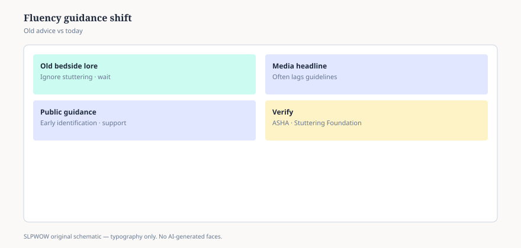

**Disclaimer.** Educational news briefing for SLPWOW. Not billing advice, not legal advice, not a treatment protocol, and not medical advice. Rules change by contractor, state, and calendar year. Verify the current CMS, MAC, state, or ASHA page before you act. This series does not evaluate patients and does not publish worksheets.

A generation of adults was told: ignore it, don’t say the word, he will grow out of it if you pretend it is not happening. Some children did become fluent. Yairi’s epidemiology work is the group-level story people quote. Group-level stories are not a permission slip to silence a family who is worried, and they are not a permission slip to silence the child who is already fighting the word.

ASHA’s public stuttering page and the Stuttering Foundation’s public pages have been saying a different, quieter thing for years: you can talk about it. You can keep the room patient. You can ask for a specialist. You do not have to perform surprise every time a sound repeats. Identify the Signs, ASHA’s consumer campaign, puts “repeating sounds” in the same public list as other reasons to ask — as a conversation, not as a midnight diagnosis.

That is the news. The folklore is dying slower than the pages.

## What “don’t mention it” cost

It taught children that the most interesting fact about their mouth was unspeakable. It taught teachers to look away. It taught pediatricians to say wait-and-see in the same breath CDC was trying to retire for other milestones (the pediatric pack lives there; this pack will not steal it). It taught some SLPs that preschool fluency work was a third rail.

It also, to be fair, was a reaction to an older, crueler folklore: call it out, interrupt, make them start over, shame. The pendulum parked in silence because shame had been worse. Pendulums are not guidelines.

## What public guidance is not doing

It is not handing you Lidcombe steps. It is not handing you fluency-shaping drills. It is not telling you which camp in the fluency wars won. Those wars are real and they have papers. Read the papers with essays 01–05. Do not download a parent program from a news site. Copyright and ethics both say no.

It is not telling you every preschool repeater needs weekly therapy tomorrow. It is telling you that worry is allowed, that a look from someone who works with stuttering is allowed, and that “ignore it” is not a treatment plan.

## School vs clinic, again

A 504 for extra time and a teacher who does not finish the child’s sentences (essay 33) can be the whole school story. An IEP can be the story when language or classroom access is in the mix. A clinic can be the story when the family wants it and a plan will pay. Three wallets (essay 34). One mouth. Mash them and you get a child who is “being treated” in three religions and spoken to in none.

## A hallway version

“The old advice to never mention stuttering is not what ASHA’s public page is doing. I’m not going to run a therapy program in this brief, and I’m not going to tell a parent to wait in silence.” If they want a public page, send ASHA or the Stuttering Foundation. If they want a protocol, they want a clinician who works fluency on purpose.

Adults who stutter are not a failed preschool story. Public pages exist for them too. Workplace discrimination, a physician who still says “slow down,” a dating script that treats the stutter as a reveal — those are 2026 headlines as much as any toddler post. This pack will not become an advocacy kit. It will say the silence folklore was always a poor fit for a person who already has a job and a mouth they live in. Mentioning the stutter in the room, when the person wants it mentioned, is not therapy. It is manners.

Essay 41 is the other pediatric headline that sits at the lunch table: feeding, when AAP and ASHA share a press cycle and a worried parent.

<figure class="slpwow-figure slpwow-figure--infographic" itemscope itemtype="https://schema.org/ImageObject">
  
  <figcaption itemprop="caption">
    <strong>Figure 1.</strong> Fluency guidance shift (schematic). Old ignore-it lore versus current early-support guidance — verify ASHA.
    SLPWOW SLP News — practice pack — original editorial SVG. Not billing, legal, or clinical advice.
  </figcaption>
</figure>
