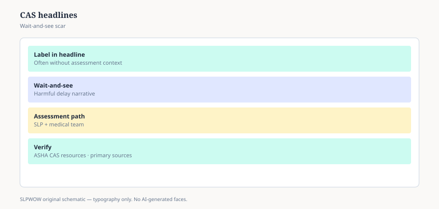

**Disclaimer.** Educational news briefing for SLPWOW. Not billing advice, not legal advice, not a treatment protocol, and not medical advice. Rules change by contractor, state, and calendar year. Verify the current CMS, MAC, state, or ASHA page before you act. This series does not evaluate patients and does not publish worksheets.

Childhood apraxia of speech has two public lives. In one, it is a careful motor-planning diagnosis an SLP makes over time, with ASHA’s technical report and public page in the background. In the other, it is a hashtag, a documentary noun, and a reason a relative says “just get the apraxia therapy.” Both lives generate headlines. Only one of them should generate a chart.

## What the public page is doing

ASHA’s consumer CAS page describes a difficulty planning and programming the movements for speech, not a muscle that is “too weak,” not a child who is “not trying.” It tells families that an SLP is the person who diagnoses it, that it can sit next to other conditions, and that waiting because “he’ll talk when he’s ready” is a bad plan if speech is barely arriving. Identify the Signs sits nearby: little speech, speech that stays hard for familiars, loss of a skill. Those are invitations. They are not a quiz you fail at 2 a.m.

The pediatric milestone pack on this site already told parents how to read a 75-percent chart. This pack will not re-teach the fridge. It will say the CAS headline problem is the opposite of the milestone problem: not “the chart scared us,” but “the internet named us.”

## How headlines oversell

They imply a blood test. There is not one. They imply a single program with a trademark that “is the one.” There are approaches with more research than others. There is not a sacrament. They imply that every late talker has CAS. Most do not. “Late talking” in research is a vocabulary description at a measured age, not a motor-planning stamp. Essay 01’s five questions apply to every CAS paper a vendor forwards.

They imply that school eligibility equals the medical noun, or the reverse (essay 28). A child can have an IEP for speech-sound needs without a CAS label. A child can carry a clinic’s CAS label and a school team that uses different words. Two clocks (essay 30).

## How headlines undersell

They tell families to wait until the child is “old enough to test.” Waiting for a perfect test is how you lose a year of communication, including AAC (essay 43). They treat any unusual speech as apraxia and then, when it is not, treat the family as dramatic. They hide bilingual homes as a confounder. ASHA’s public bilingual pages have been saying for years that two languages are not a delay factory.

## What this page will not do

PROMPT hierarchies. DTTC steps. Integral stimulation lists. Home drill sheets. Those are copyrighted, licensed, or both. A news pack that dumps them is a lawsuit and a bad clinician. If a paper changed the evidence temperature in 2024–2026, read the paper. Do not ask a blog for the cues.

## A hallway version

“CAS is a real diagnosis with a public ASHA page and a lot of bad headlines. I’m not going to name a child from a video, and I’m not going to photocopy a cueing program.” If a parent wants the public page, send it. If a colleague wants a journal club, start with methods, not the trademark.

Genetic headlines will keep arriving. A rare-gene story is not a clinic algorithm, and it is not a reason to tell every family to sequence first and talk later. If a paper names a gene and a speech profile, read it as a paper (essay 01). If a lab markets a panel in the same week, read the conflict line (essay 09). The child in front of you still needs a way to say something today. That way might be AAC (essay 43) while the noun debate continues. Headlines that delay communication to protect a future label have the order wrong.

Essay 43 is the tool that should have been in the room the whole time: AAC as access news, not as an app store ranking.

<figure class="slpwow-figure slpwow-figure--infographic" itemscope itemtype="https://schema.org/ImageObject">
  
  <figcaption itemprop="caption">
    <strong>Figure 1.</strong> Childhood apraxia headlines (schematic). Labels in news are not assessments — verify clinical evaluation paths.
    SLPWOW SLP News — practice pack — original editorial SVG. Not billing, legal, or clinical advice.
  </figcaption>
</figure>
