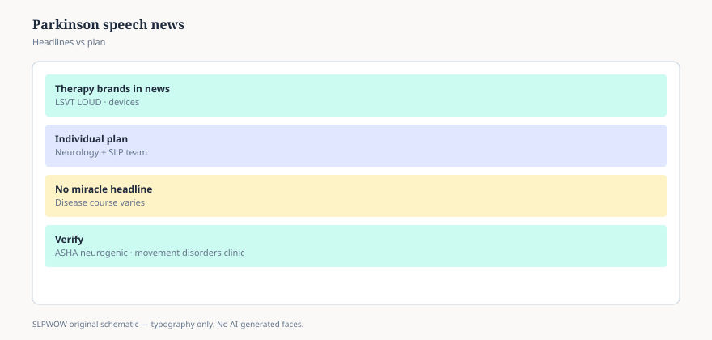

**Disclaimer.** Educational news briefing for SLPWOW. Not billing advice, not legal advice, not a treatment protocol, and not medical advice. Rules change by contractor, state, and calendar year. Verify the current CMS, MAC, state, or ASHA page before you act. This series does not evaluate patients and does not publish worksheets.

Parkinson’s speech is quiet, flat, and fast in the ways families notice before the person does. NINDS and NIDCD keep public disease pages. ASHA keeps a public dysarthria page. Every few years a headline arrives anyway: a trademarked program, a gadget, a DBS story, a drug trial that mentioned speech as a footnote. The person in the lobby still cannot be heard at a restaurant.

## What the public pages are willing to say

That speech and swallow can be part of Parkinson’s. That an SLP is a reasonable referral. That loudness and clarity are not a moral failing. That swallow risk is real and not always a cough you can hear. That is enough for a family to ask. It is not enough for a vendor to own the disease.

## What the program headlines do

They collapse a literature into a brand. Some brands have randomized trials. Some have devoted clinicians and a conference circuit. Some have both. Essay 01 still applies: who was in the study, what was done, what was measured, who paid (essay 09). A trademark is not a GRADE. A CEU is not a coverage determination.

This pack will not name a best program. Naming a best program is how a news site becomes an ad. It will say: if your department only knows one noun for Parkinson’s speech, that is a staffing story, not a settled science story.

## Payment sits in familiar attics

Outpatient Part B (essays 11–18). Maintenance and Jimmo (essay 32) — plateau is not automatically unskilled when the cueing still has to be skilled. SNF PDPM will notice neurologic category and maybe swallow and diet (essay 19). Home health PDGM has a neuro/stroke drawer and also “any group if it’s on the plan” (essay 20). Telehealth may be how a rural person still gets a loudness check in 2026 (essay 23). None of that is a Parkinson’s-specific benefit.

## DBS, meds, and the headline that forgets speech

When a device or a titration helps tremor, speech can improve, worsen, or trade. That sentence belongs in the pre-surgical counseling a neurologist should already be doing. SLPs who work movement disorders keep saying it. Headlines about “getting your life back” rarely include the spouse who still cannot hear the order at a drive-through. You can be glad about a tremor and still ask about the voice. That is not spoiling the win.

## What this page will not do

LSVT homework. SPEAK OUT! session lists. EMST pressures. Device settings. Those are licensed or protocol objects. If you are certified in a program, you already have the binder. If you are not, a news brief will not become one.

## A hallway version

“Parkinson’s speech has public pages and a lot of branded headlines. I’m going to keep the referral path open, keep Jimmo in my pocket for the plateau, and not photocopy a program.” If a support group wants a speaker, send them ASHA’s public dysarthria page and a clinician. If a vendor wants a testimonial, they want essay 09.

Care partners do a lot of the hearing. A spouse who has become the interpreter is a data point and a fatigue story. Public pages mention families; headlines mention the person with the tremor. You can invite the partner into the eval without turning them into the therapist. You can also notice when the partner has started ordering for everyone at the table. That noticing is clinical. The program binder, if you have one, can wait until the room has been heard — the quiet voice and the tired interpreter both.

Essay 46 is the other survivorship headline: head and neck cancer, and communication after the building is done celebrating the scan.

<figure class="slpwow-figure slpwow-figure--infographic" itemscope itemtype="https://schema.org/ImageObject">
  
  <figcaption itemprop="caption">
    <strong>Figure 1.</strong> Parkinson speech headlines (schematic). Branded therapy news is not everyone's treatment plan.
    SLPWOW SLP News — practice pack — original editorial SVG. Not billing, legal, or clinical advice.
  </figcaption>
</figure>
