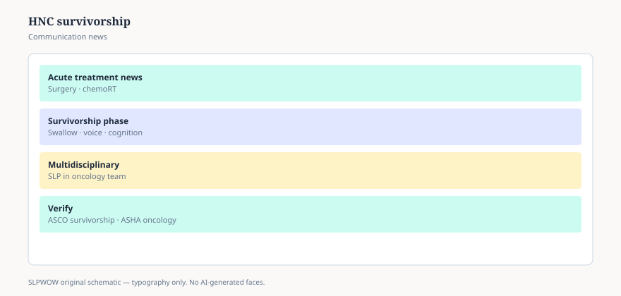

**Disclaimer.** Educational news briefing for SLPWOW. Not billing advice, not legal advice, not a treatment protocol, and not medical advice. Rules change by contractor, state, and calendar year. Verify the current CMS, MAC, state, or ASHA page before you act. This series does not evaluate patients and does not publish worksheets.

Oncology headlines like a clean scan. Survivorship is quieter: a person who is alive and cannot eat in a restaurant, or cannot be understood on a phone, or cannot smell the food they are still trying to finish. NCI and the American Cancer Society keep public head-and-neck pages. ASHA and NIDCD keep the communication pages. The news is the seam between those URLs — and the fact that many tumor boards still invite the SLP late, or not.

## What “survivorship” hid

Lymphedema in the floor of mouth. Trismus. A voice that is not the voice. A tongue that was rebuilt and does not know the old /s/. A swallow that passed a study in April and failed Thanksgiving. Teeth that radiation retired. A larynx that is gone and a stoma that is new. AAC that should have been in the room before the OR (essay 43). Depression that looks like noncompliance.

None of that is rare in our clinics. All of it is still surprising to a family who was told the goal was cure. Cure and communication are allowed to share a sentence. Headlines prefer one noun.

## Where the SLP actually sits in the story

Before — if the building is serious — for a baseline, a counseling conversation, a device plan. During radiation, in buildings that staff it, for the daily swallow of a person who is losing the wish to eat. After, for years, because fibrosis does not respect a 90-day episode. Jimmo (essay 32) is not only a Parkinson’s friend. A skilled swallow or voice visit in year two can still be a coverage story when the facts fit. Plateau is not a party.

School SLPs meet the pediatric version: a child who missed a year, a teen with a new voice, a cafeteria that has not translated the hospital diet (essay 31). Two clocks (essay 30). One lunch period.

## Payment and access, without a cookbook

Instrumental looks (essay 37) are how some of these arguments get settled, and how some wait lists get longer. FEES at bedside during a hot trial of radiation is an access story. VFSS after a free flap is an access story. LCDs (essay 22) will or will not be kind to the second look. Telehealth (essay 23) can hold a counseling week and cannot replace a scope. PDPM will notice oral and laryngeal cancers as SLP comorbidities if the MDS tells the truth (essay 19). None of that is a protocol for ROM.

## What this page will not do

Radiation swallow exercise lists. TEP voicing steps. Device care. “Eat this on week three.” Those are oncology-SLP objects with copyrights and liability. If your cancer center has a pathway, date it. If a 2025 ACS survivorship PDF added a communication checkbox, prefer that PDF at publish time and `[VERIFY]` the URL. Do not ask this brief to become the pathway.

## A hallway version, and a close for the pack

“The scan is not the swallow, and it is not the voice. Public cancer pages exist; so do ours. I’m not going to dump a radiation protocol onto a news site.” If a reporter wants a human-interest angle, give them the seam, not a patient. If a vendor wants to brand a ‘survivorship shake,’ see essay 09.

Forty-six pieces ago we started with a 6:41 a.m. PDF. The habits were small: methods first, dollars in English, two clocks, headlines that refuse to become homework. If a colleague wants a protocol from this folder, the folder will keep disappointing them. If they want a way to read the mail without losing their integrity, that was the job.

Staged. Draft. Not live. The next reader is an editor with a license, not a sitemap.

<figure class="slpwow-figure slpwow-figure--infographic" itemscope itemtype="https://schema.org/ImageObject">
  
  <figcaption itemprop="caption">
    <strong>Figure 1.</strong> HNC survivorship communication (schematic). Survivorship swallow and voice needs — verify oncology and ASHA guidance.
    SLPWOW SLP News — practice pack — original editorial SVG. Not billing, legal, or clinical advice.
  </figcaption>
</figure>
