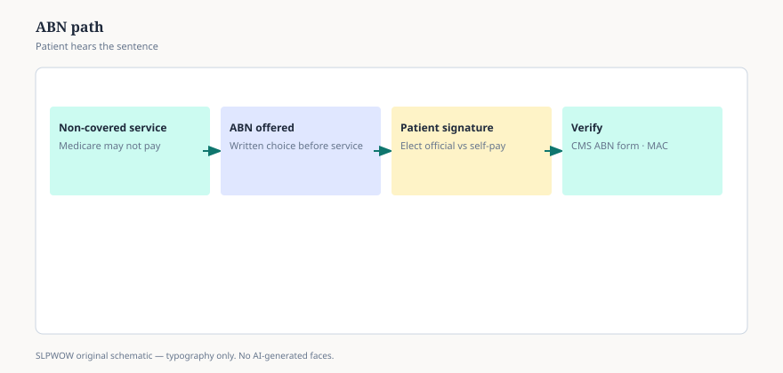

# Embed — abn-when-medicare-may-not-pay

```html
<figure class="slpwow-figure slpwow-figure--infographic" itemscope itemtype="https://schema.org/ImageObject">
  
  <figcaption itemprop="caption">
    <strong>Figure 1.</strong> ABN path (schematic). When Medicare may not pay — patient choice documented before service.
    <span class="figure-credit">SLPWOW SLP News — practice pack — original editorial SVG. Not billing, legal, or clinical advice.</span>
  </figcaption>
</figure>
```
