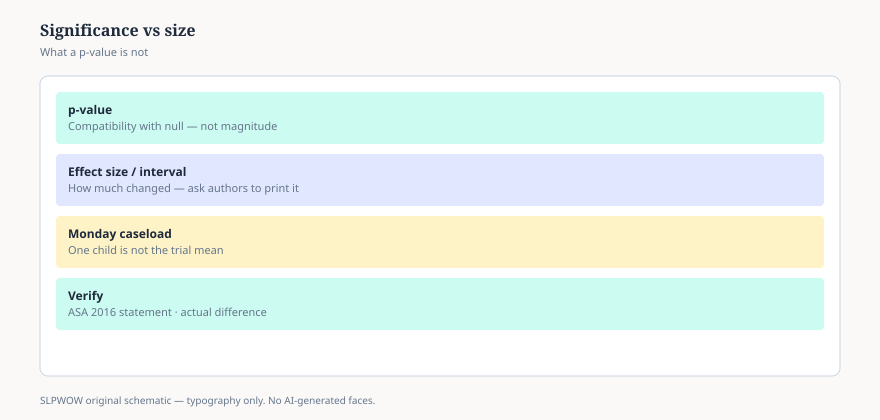

# Embed — effect-sizes-and-p-values

```html
<figure class="slpwow-figure slpwow-figure--infographic" itemscope itemtype="https://schema.org/ImageObject">
  
  <figcaption itemprop="caption">
    <strong>Figure 1.</strong> p-value versus effect size (schematic). Statistical significance is not the size of a change on your caseload.
    <span class="figure-credit">SLPWOW SLP News — practice pack — original editorial SVG. Not billing, legal, or clinical advice.</span>
  </figcaption>
</figure>
```
