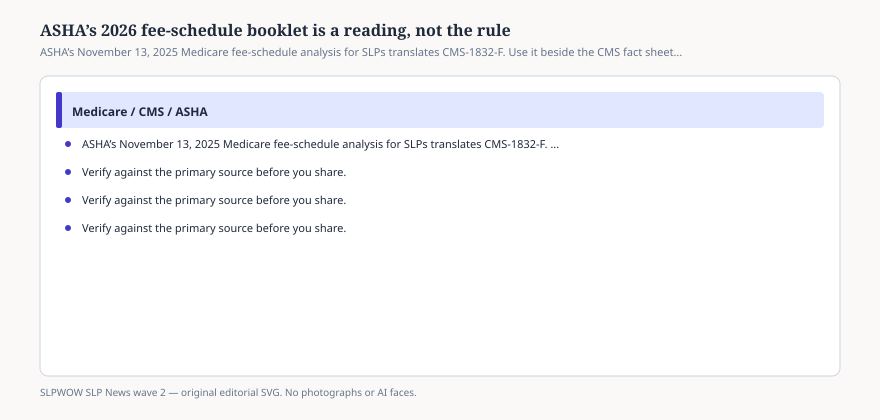

# ASHA’s 2026 fee-schedule booklet is a reading, not the rule

*Educational news brief for SLPWOW. Not legal advice, not billing advice, and not a substitute for reading the primary source or for evaluation by a licensed clinician.*

On 13 November 2025 ASHA posted the first edition of *Medicare Fee Schedule for Speech-Language Pathologists, 2026*. It is the document most outpatient managers will actually open. It is also the document most often treated as if it were CMS. It is not. CMS-1832-F is the final rule. ASHA’s PDF is a profession-specific reading: two conversion factors, a warning about leftover cuts, tables of national non-facility rates, and a running argument that Congress still has to fix the system.

Read both. Quote the one that owns the number.

## What ASHA added that the fact sheet does not

<figure class="slpwow-figure slpwow-figure--infographic" itemscope itemtype="https://schema.org/ImageObject">
  
  <figcaption itemprop="caption">
    <strong>Figure 1.</strong> ASHA’s November 13, 2025 Medicare fee-schedule analysis for SLPs translates CMS-1832-F. Use it beside the CMS fact sheet, not instead of it.
    SLPWOW SLP News wave 2 — original SVG. Not legal, billing, or clinical advice.
  </figcaption>
</figure>

The CMS newsroom fact sheet explains why there are now two conversion factors, why there is a 2.5 percent efficiency adjustment, and why practice-expense math is shifting toward office-based settings. It does not sit with CPT 92507 and tell an SLP whether that code is exempt. ASHA does.

The booklet’s useful claims, paraphrased:

- Most SLPs are not qualifying APM participants and should use the **$33.40** conversion factor, not the **$33.57** APM factor.
- Congress stacked a MACRA 0.25 percent non-APM update with a one-year 2.5 percent bump. CMS’s own impact story for SLPs is still roughly minus 1 to minus 2 percent before sequestration and locality.
- ASHA’s political sentence is blunter than CMS’s: without more legislation, cumulative cuts could approach **4 percent**.
- Speech-language pathology services are paid at the **non-facility** rate regardless of setting. The 2026 PE shift that hurts facility-heavy specialties is, on average, a small help for SLP codes.
- Time-based treatment and codes on the telehealth list are outside the efficiency adjustment. **92507 is named as exempt.** Some diagnostic and non-time-based codes are not.
- National examples in the booklet: 92507 up about 2 percent; 96112 down about 1 percent. Your mix will not match the national cartoon.

Those are readings. A MAC can still apply a local coverage determination that ASHA’s table does not show.

## How to use the tables without laundering them

Table 2 in the booklet is a national Part B rate list. It is not your locality. ASHA says so on page one: contact the Medicare Administrative Contractor; use the CMS locality lookup. If you paste ASHA’s national 92507 figure into a charge master and call it “the 2026 rate,” you have invented a rate.

Do not paste ASHA’s tables into this magazine. They are copyrighted compilation plus CPT (AMA). This brief names the PDF. It does not reproduce the grid.

## The telehealth paragraph that aged in public

The November 2025 edition said CMS had finalized permanent telehealth *coverage for SLP codes* while Congress had only extended practitioner authority through 30 January 2026. That was true on the booklet’s date. The Consolidated Appropriations Act, 2026, later moved the statutory wall to 31 December 2027. Keep the booklet for RVUs. Keep the later ASHA news post and the CMS Therapy Services page for the sunset. A first edition is allowed to be overtaken by a statute. A clinic binder is not allowed to freeze the January date.

## What this is not

Not a charge ticket. Not permission to ignore MPPR, KX, or medical-necessity notes. Not a promise that 92507 will rise in your town. Not an ASHA endorsement of any billing vendor.

If you have time for one comparison this quarter, open the CMS fact sheet and ASHA’s “Conversion Factor” section side by side. When they agree, you have a number. When ASHA adds a political warning CMS omitted, label it as advocacy.

## Sources

- ASHA, *2026 Medicare Fee Schedule for Speech-Language Pathologists* (first edition, 13 November 2025), https://www.asha.org/siteassets/reimbursement/2026-medicare-fee-schedule-for-speech-language-pathologists.pdf
- CMS, CY 2026 PFS Final Rule fact sheet (CMS-1832-F), https://www.cms.gov/newsroom/fact-sheets/calendar-year-cy-2026-medicare-physician-fee-schedule-final-rule-cms-1832-f
