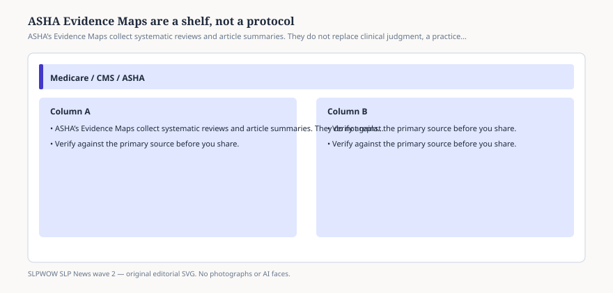

# ASHA Evidence Maps are a shelf, not a protocol

*Educational news brief for SLPWOW. Not legal advice, not billing advice, and not a substitute for reading the primary source or for evaluation by a licensed clinician.*

ASHA’s Evidence Maps are one of the association’s better public habits. A map — telepractice, aphasia intensity, a disorder page — is a curated pile of systematic reviews and structured article summaries. The telepractice map says it in one sentence: research on audiology and speech-language pathology services delivered at a distance, all ages, all settings. Then it sends you into records.

That is a shelf. A shelf is not a protocol, not a Local Coverage Determination, and not a reason to tell a family that “ASHA says telepractice works for everyone.”

## How to read a map row

<figure class="slpwow-figure slpwow-figure--infographic" itemscope itemtype="https://schema.org/ImageObject">
  
  <figcaption itemprop="caption">
    <strong>Figure 1.</strong> ASHA’s Evidence Maps collect systematic reviews and article summaries. They do not replace clinical judgment, a practice act, or a plan of care.
    SLPWOW SLP News wave 2 — original SVG. Not legal, billing, or clinical advice.
  </figcaption>
</figure>

A typical map card names the paper, the question, the number of studies, and a cautious paragraph. The aphasia telerehabilitation review this desk used later in the research stack reported language gains in 28 of 31 studies and no significant face-to-face versus remote difference in four of six head-to-heads. That is a literature shape. It is not a billing code. It is not a guarantee that your rural broadband will carry a Western Aphasia Battery.

The constraint-induced language therapy update is even more map-like: modest support, mixed intensity findings, preliminary because the studies are few and uneven. If your administrator wants a one-word answer, the map is the wrong genre.

## What maps are for in a newsroom

Wave 2 uses maps the way a magazine should: to find the public summary of a review, then send the reader to the journal when the claim is load-bearing. We do not scrape ASHA’s HTML and call it ours. We do not reproduce their evidence tables. We name the map and the underlying paper.

The 2016 Scope of Practice already told clinicians that evidence-based practice has three legs. The map is only the research leg, and only the reviews ASHA has catalogued. Practitioner expertise and the person’s values still have to show up in the note.

## What not to paste into an IEP

Do not paste a map abstract into an eligibility report as if it were a test result. Do not tell a payer that an Evidence Map “authorizes” 92507 via telehealth — CMS and the statute do that, or they do not. Do not treat a map that includes school studies as a caseload formula.

If your department wants a journal club, pick one map, pick two reviews, and argue. That is the honest use.

## A map is also a date stamp

Cards get added. Cards get stale. A 2008 review that was updated once is not “what ASHA believes this morning.” When you cite a map in a staff note, cite the paper’s year and the date you opened the card. If the card is a summary of a summary, go get the journal PDF before you change a program. The map is a finding aid. The finding aid is allowed to be wrong about a forest plot; the journal is the thing you argue with.

Graduate students love maps because they feel like a finished literature review. They are not. They are a filtered shelf with ASHA’s inclusion habits. Missing a negative trial is a known risk of any curated pile. Say that out loud in the journal club so the newest hire does not treat a green card as a mandate.

## Sources

- ASHA Evidence Maps, Telepractice landing page, https://apps.asha.org/EvidenceMaps/Maps/LandingPage/f8eee3d9-4739-4ba6-b925-5d2f3ad809b6
- ASHA, Scope of Practice in Speech-Language Pathology, https://www.asha.org/policy/sp2016-00343/
